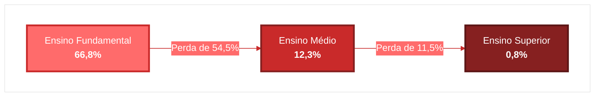
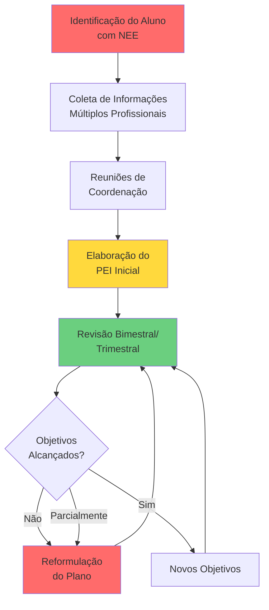
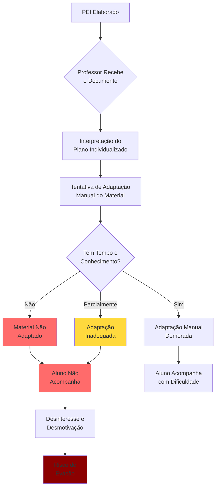
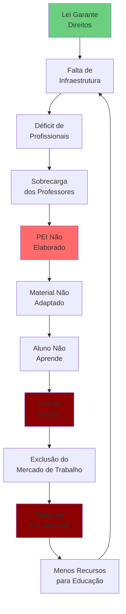

# Problemática

No Brasil, **45,5% dos alunos com deficiência** que necessitam de Atendimento Educacional Especializado estudam em escolas que não oferecem esse recurso. O resultado desse colapso sistêmico é devastador: apenas **25,6%** das pessoas com deficiência concluem o Ensino Médio, e a exclusão educacional gera uma perda estimada de **3% a 7% do PIB nacional**. Mesmo com a legislação garantindo direitos e as escolas recebendo 40% a mais de recursos por aluno com necessidades especiais, **568 municípios brasileiros** não possuem nenhum registro de atendimento educacional especializado. A Lei Brasileira de Inclusão existe há uma década, mas a distância entre o papel e a realidade das salas de aula nunca foi tão evidente.

    

        
         
    

## O Abismo Entre Lei e Prática na Educação Inclusiva Brasileira

A Lei Brasileira de Inclusão (Lei nº 13.146/2015) assegura o direito ao atendimento educacional especializado para alunos com necessidades educacionais especiais. O Plano Educacional Individualizado (PEI), embora não explicitamente mencionado na legislação, está contemplado pelo conceito de "adaptações razoáveis", permitindo que sejam realizadas as modificações e ajustes necessários para que a pessoa com deficiência desfrute de seus direitos em igualdade de condições (Barbosa, 2019).

Entretanto, a realidade nas escolas brasileiras revela um distanciamento alarmante entre o que a lei garante e o que efetivamente se pratica.

:::danger[Dados Alarmantes]
**45,5%** dos alunos com deficiência que precisam de Atendimento Educacional Especializado (AEE) estão em escolas sem esse recurso. Apenas **20,5%** das escolas brasileiras declaram oferecer AEE, e **568 municípios** não têm nenhum registro de atendimento educacional especializado.

Fonte: Estudo do Instituto Pensi, Censo Escolar 2024
:::

### A Magnitude do Problema

O Censo 2022 identificou 2,4 milhões de pessoas com diagnóstico de Transtorno do Espectro Autista (TEA) no Brasil, representando 1,2% da população. Deste total, 760,8 mil estudantes de 6 anos ou mais com autismo estão no sistema de ensino, representando 1,7% do total de estudantes (IBGE, 2025).

A progressão escolar desses alunos revela um padrão preocupante de exclusão progressiva:

Figura 1 - Progressão Escolar de Estudantes com Autismo

Fonte: IBGE (2025)

Esta queda dramática reflete os desafios enfrentados por estudantes com autismo para permanecer e progredir ao longo da trajetória educacional, sobretudo diante de barreiras de acesso, adaptação curricular e apoio institucional adequado (IBGE, 2025).

## O Gargalo na Criação e Implementação do PEI

### Processo Burocrático e Demorado

Durante nosso processo de pesquisa e conversas com profissionais da educação inclusiva, identificamos obstáculos sistêmicos na elaboração do PEI. Adriessa Santos, Diretora de Educação na Turma do Jiló, organização reconhecida com o Prêmio Empreendedor Social da Folha de São Paulo (2022), afirma:

:::tip[Perspectiva de Especialista]
"Um dos problemas urgentes da educação do Brasil que pode ser otimizado e automatizado pela IA é a burocracia para a criação de um PEI."

**Adriessa Santos**, Diretora de Educação - Turma do Jiló
:::

O PEI é um documento que deve começar a ser elaborado no início do ano letivo e não possui uma data de conclusão, sendo um processo contínuo de revisão (Nova Escola, 2024). A elaboração é uma responsabilidade coletiva e pedagógica, envolvendo professores, especialistas e a família (Pós-EAD São Luís, 2025).

Figura 1 - Ciclo Tradicional de Elaboração do PEI

Fonte: Os autores (2025)

### O Descompasso Entre Necessidade e Capacidade

    

        
         
    

A professora Ana Beatriz Araújo, pedagoga com especialização em Desvios do Desenvolvimento Humano e professora do Atendimento Educacional Especializado, questiona durante nossa pesquisa:

:::warning[Realidade na Sala de Aula]
"Se o PEI é tão necessário e tão demandado na sala de aula comum, por que tantos professores não fazem? Por desconhecimento, por falta de orientação, por falta de apoio para a elaboração deste documento e por não entender ainda a real importância deste documento."

**Ana Beatriz Araújo**, Professora de AEE e Produtora de Conteúdo em Educação Especial
:::

Os dados confirmam essa percepção. O Brasil levaria **468 anos** para formar todos os professores necessários para a educação especial, considerando o ritmo atual de formação (Folha de S.Paulo, 2025). A proporção atual é alarmante: em Campinas (SP), existe 1 professor de educação especial para cada 54 alunos com deficiência (G1 Campinas, 2025).

Tabela 2 - Déficit de Recursos Humanos na Educação Especial

| Indicador | Dado | Impacto |
|-----------|------|---------|
| Tempo para formar professores necessários | 468 anos | Déficit estrutural permanente |
| Proporção aluno/professor (Campinas) | 1:54 | Atendimento inadequado |
| Professores sob estresse | 71% | Sobrecarga e burnout |
| Escolas com intérprete de Libras | < 4% | Exclusão de surdos |

Fonte: Compilação de dados (Folha de S.Paulo, 2025; G1 Campinas, 2025; Agência Brasil, 2023; VEJA, 2025)

:::info[Contexto Internacional]
O Brasil ocupa a **última posição** em ranking internacional que investiga o excesso de trabalho de professores (Portal Verdade, 2025).
:::

## A Segunda Barreira: Implementação do PEI na Sala de Aula

Mesmo quando o PEI é elaborado, sua implementação enfrenta obstáculos significativos. Relatos pessoais e acadêmicos apontam para uma dificuldade constante em se conseguir um planejamento efetivo, tanto em escolas particulares de alto custo quanto em escolas públicas (E-docente, 2025).

### Adaptação de Material Didático: O Gargalo Invisível

A adaptação de materiais didáticos é um processo manual, demorado e que exige conhecimento especializado. Apenas **0,1%** das escolas brasileiras são consideradas totalmente acessíveis em sua infraestrutura (O Globo, Censo Escolar 2024), e a sobrecarga de trabalho de 71% dos professores é agravada pela necessidade de adaptação manual de materiais (Agência Brasil, 2023).

Figura 2 - Desafios na Implementação do PEI

Fonte: Os autores (2025)

Alunos podem expressar desinteresse e falta de motivação com atividades escolares que não são atrativas ou adaptadas às suas necessidades, chegando a apresentar sintomas físicos como dores e enjoos (E-docente, 2025).

## O Custo da Exclusão Educacional

### Impacto Individual e Social

A falta de inclusão efetiva resulta em taxas alarmantes de evasão e baixa conclusão de escolaridade para pessoas com deficiência:

Tabela 3 - Conclusão de Escolaridade: Comparação PcD vs. Sem Deficiência

| Nível de Escolaridade | Pessoas com Deficiência | Pessoas sem Deficiência |
|-----------------------|-------------------------|-------------------------|
| Ensino Médio Completo | 25,6% | 57,3% |
| Ensino Superior Completo | 7% | 20,9% |
| Sem Educação Básica | 63,3% | - |

Fonte: IBGE, Pnad Contínua (2022)

Em dois anos de pandemia, **um em cada dez estudantes com deficiência não tiveram nenhuma aula com recursos de acessibilidade** (CNN Brasil, 2022). Pesquisa do Itaú Social (2022) revela que **31%** dos estudantes com deficiência não conseguem acompanhar as atividades escolares, e **25%** não se sentem acolhidos.

### Impacto Econômico Nacional

A exclusão educacional gera consequências econômicas mensuráveis. A exclusão de pessoas com deficiência pode representar uma perda de cerca de **3% a 7% do PIB** de um país (CNN Brasil, 2021; Observatório 3º Setor, 2021).

Tabela 4 - Impacto Econômico da Exclusão

| Indicador | Dado | Contexto |
|-----------|------|----------|
| Perda estimada no PIB | 3% a 7% | Por exclusão de PcD do mercado |
| Taxa de ocupação (PcD) | 26,6% | vs. 60,7% população geral |
| Diferença salarial | -31,2% | PcD ganham menos |
| Diferença salarial (Ensino Superior) | -R$ 1.135,00 | Mesmo nível de escolaridade |

Fonte: Compilação de dados (CNN Brasil, 2021; IBGE, 2023; Alma Preta, 2024; FRM, 2023)

## O Paradoxo do Financiamento

Apesar das redes de ensino receberem **40% a mais** do que o valor padrão por matrícula de estudante da educação especial (Fator de ponderação de 1,40 no FUNDEB), o investimento público total em educação permanece insuficiente.

Em 2023, o investimento público em educação foi de R$ 540 bilhões, equivalente a **4,9% do PIB** (Anuário Todos Pela Educação, 2025). O Plano Nacional de Educação (PNE 2014-2024) previa a aplicação de **10% do PIB** no setor, mas esse objetivo não foi alcançado (Proifes, 2024).

:::warning[Contradição Estrutural]
O estudo do Instituto Pensi demonstra que "a força da legislação e a inclusão observada no Censo não andam juntas — e ninguém (estado ou capital) passou de 7 nessa 'nota da legislação'."

Fonte: Estudo do Instituto Pensi, Censo Escolar 2024
:::

### Ineficiência Governamental

O Brasil foi classificado como o **segundo país com pior eficiência governamental** em um ranking global (Folha do ES, 2025), refletindo a incapacidade de transformar recursos legais e financeiros em resultados práticos na educação inclusiva.

## Desigualdade Regional

As disparidades regionais na oferta de AEE evidenciam a falha na garantia da equidade educacional:

Tabela 5 - Oferta de AEE por Região

| Região | Percentual de Escolas com AEE |
|--------|-------------------------------|
| Sul | ~33% |
| Centro-Oeste | ~26% |
| Média Nacional | 20,5% |
| Sudeste | 18,1% |
| Nordeste | 17,4% |

Fonte: Estudo do Instituto Pensi, Censo Escolar 2024

:::danger[Exclusão Geográfica]
**568 municípios** brasileiros não têm **nenhum registro** de atendimento educacional especializado, criando "desertos" de inclusão educacional.
:::

## A Oportunidade Tecnológica Subutilizada

Apesar do cenário desafiador, dados recentes mostram abertura para soluções tecnológicas:

- **56%** dos professores brasileiros já utilizam ferramentas de IA para preparar aulas (APUFSC, 2025)
- **7 em cada 10 alunos do Ensino Médio** usam IA generativa em pesquisas escolares (Cetic.br, TIC Educação 2024)
- O Brasil lidera em EdTechs na América Latina, dominando **79,6%** dos investimentos regionais, totalizando mais de US$ 620 milhões entre 2015 e 2025 (Canaltech, 2025)

A IA oferece tecnologias como aprendizagem adaptativa, reconhecimento de fala e tradução em tempo real, que podem eliminar barreiras (Jornal da USP, 2024; Journal Ilustração, 2024).

## Síntese da Problemática

O sistema educacional brasileiro enfrenta um problema sistêmico de múltiplas dimensões:

Figura 3 - Ciclo da Exclusão Educacional

Fonte: Os autores (2025)

Este ciclo perpetua a exclusão e desperdiça o potencial de milhões de brasileiros. A automatização e otimização da criação do PEI, aliada à adaptação inteligente de materiais didáticos, representa uma oportunidade de romper este ciclo, transformando a burocracia em inclusão efetiva.

## Referências

AGÊNCIA BRASIL. Pesquisa mostra que 71% dos professores estão estressados. 2023. Disponível em: https://agenciabrasil.ebc.com.br/educacao/noticia/2023-04/pesquisa-mostra-que-71-dos-professores-estao-estressados. Acesso em: 25 out. 2025.

ALMA PRETA. Pessoas com deficiência têm renda menor e menos acesso à educação. 2024. Disponível em: https://almapreta.com.br/sessao/cotidiano/pessoas-com-deficiencia-tem-renda-menor-e-menos-acesso-a-educacao/. Acesso em: 25 out. 2025.

APUFSC. Professores no Brasil usam mais IA que média dos países da OCDE. 2025. Disponível em: https://www.apufsc.org.br/2025/10/07/professores-no-brasil-usam-mais-ia-que-media-dos-paises-da-ocde/. Acesso em: 25 out. 2025.

BARBOSA, Vânia Benvenuti. Conhecimentos necessários para elaborar o Plano Educacional Individualizado - PEI. Rio Pomba: IF Sudeste MG, 2019.

CANALTECH. Brasil lidera em número de edtechs na América Latina e captou mais de R$ 3 tri. 2025. Disponível em: https://canaltech.com.br/mercado/brasil-lidera-em-numero-de-edtechs-na-america-latina-e-captou-mais-de-r-3-tri/. Acesso em: 25 out. 2025.

CETIC.BR. Sete em cada dez alunos do Ensino Médio usam IA generativa em pesquisas escolares, revela TIC Educação. 2024. Disponível em: https://www.cetic.br/pt/noticia/sete-em-cada-dez-alunos-do-ensino-medio-usam-ia-generativa-em-pesquisas-escolares-revela-tic-educacao/. Acesso em: 25 out. 2025.

CNN BRASIL. Países podem perder até 7% do PIB ao excluir pessoas com deficiências. 2021. Disponível em: https://www.cnnbrasil.com.br/economia/macroeconomia/paises-podem-perder-ate-7-do-pib-ao-excluir-pessoas-com-deficiencias/. Acesso em: 25 out. 2025.

CNN BRASIL. Estudantes com deficiência têm maior risco de evasão escolar, aponta estudo. 2022. Disponível em: https://www.cnnbrasil.com.br/nacional/estudantes-com-deficiencia-tem-maior-risco-de-evasao-escolar-aponta-estudo/. Acesso em: 25 out. 2025.

E-DOCENTE. O que é PEI? Desafios e realidades na implementação do Plano. 2025. Disponível em: https://www.edocente.com.br/blog-o-que-e-pei/. Acesso em: 25 out. 2025.

FOLHA DE S.PAULO. Brasil levaria 468 anos para formar todos os professores para educação especial, diz estudo. 2025. Disponível em: https://www1.folha.uol.com.br/educacao/2025/09/brasil-levaria-468-anos-para-formar-todos-os-professores-para-educacao-especial-diz-estudo.shtml. Acesso em: 25 out. 2025.

FOLHA DO ES. Brasil é o segundo país com pior eficiência governamental. 2025. Disponível em: https://folhadoes.com/brasil-e-o-segundo-pais-com-pior-eficiencia-governamental/. Acesso em: 25 out. 2025.

FRM. Como está o mundo do trabalho para PcDs? 2023. Disponível em: http://www.frm.org.br/conteudo/educacao-profissional/noticia/como-esta-o-mundo-do-trabalho-para-pcds. Acesso em: 25 out. 2025.

G1 CAMPINAS. Campinas tem 1 professor de educação especial para cada 54 alunos, aponta instituto. 2025. Disponível em: https://g1.globo.com/sp/campinas-regiao/noticia/2025/09/22/instituto-aponta-1-professor-de-educacao-especial-para-cada-54-alunos-em-campinas-e-alerta-para-risco-de-exclusao-no-ensino.ghtml. Acesso em: 25 out. 2025.

IBGE. Censo 2022 identifica 2,4 milhões de pessoas diagnosticadas com autismo no Brasil. 2025. Disponível em: https://agenciadenoticias.ibge.gov.br/agencia-noticias/2012-agencia-de-noticias/noticias/43464-censo-2022-identifica-2-4-milhoes-de-pessoas-diagnosticadas-com-autismo-no-brasil. Acesso em: 25 out. 2025.

IBGE. Pessoas com deficiência têm menor acesso à educação, ao trabalho e à renda. 2023. Disponível em: https://agenciadenoticias.ibge.gov.br/agencia-noticias/2012-agencia-de-noticias/noticias/37317-pessoas-com-deficiencia-tem-menor-acesso-a-educacao-ao-trabalho-e-a-renda. Acesso em: 25 out. 2025.

ITAÚ SOCIAL. Estudantes com deficiência correm mais risco de evasão escolar, segundo pesquisa. 2022. Disponível em: https://www.itausocial.org.br/noticias/estudantes-com-deficiencia-correm-mais-risco-de-evasao-escolar-segundo-pesquisa/. Acesso em: 25 out. 2025.

JOURNAL ILUSTRAÇÃO. Impacto da inteligência artificial na educação. 2024. Disponível em: https://journal.editorailustracao.com.br/index.php/ilustracao/article/view/346. Acesso em: 25 out. 2025.

JORNAL DA USP. Inteligência artificial responsável para acessibilidade e inclusão no ensino superior. 2024. Disponível em: https://jornal.usp.br/artigos/inteligencia-artificial-responsavel-para-acessibilidade-e-inclusao-no-ensino-superior/. Acesso em: 25 out. 2025.

NOVA ESCOLA. Inclusão: por que e como construir o Plano Educacional Individualizado (PEI). 2024. Disponível em: https://novaescola.org.br/conteudo/21839/o-que-e-como-construir-plano-educacional-individualizado-pei. Acesso em: 25 out. 2025.

O GLOBO. Apenas 0,1% das escolas brasileiras são totalmente acessíveis. Censo Escolar, 2024. Disponível em: https://oglobo.globo.com/brasil/noticia/2024/02/29/apenas-01percent-das-escolas-brasileiras-sao-totalmente-acessiveis-ferramenta-do-globo-mostra-as-que-se-saem-melhor.ghtml. Acesso em: 25 out. 2025.

OBSERVATÓRIO 3º SETOR. Ao excluir pessoas com deficiência, um país pode perder 7% do PIB. 2021. Disponível em: https://observatorio3setor.org.br/ao-excluir-pessoas-com-deficiencia-um-pais-pode-perder-7-do-pib/. Acesso em: 25 out. 2025.

PORTAL VERDADE. Brasil é o país em que professores mais sofrem com sobrecarga de trabalho, aponta pesquisa. 2025. Disponível em: https://portalverdade.com.br/brasil-e-o-pais-em-que-professores-mais-sofrem-com-sobrecarga-de-trabalho-aponta-pesquisa/. Acesso em: 25 out. 2025.

PÓS-EAD SÃO LUÍS. Como fazer um PEI na prática: guia completo para educadores. 2025. Disponível em: https://www.poseadsaoluis.com.br/blog-como-fazer-pei-guia-pratico-educadores/. Acesso em: 25 out. 2025.

PROIFES. Novo PNE: debatedores defendem investimento de 10% do PIB em educação. 2024. Disponível em: https://proifes.org.br/novo-pne-debatedores-defendem-investimento-de-10-do-pib-em-educacao/. Acesso em: 25 out. 2025.

TODOS PELA EDUCAÇÃO. Anuário Brasileiro da Educação Básica 2025: Financiamento da educação. 2025. Disponível em: https://anuario.todospelaeducacao.org.br/2025/capitulo-9-financiamento.html. Acesso em: 25 out. 2025.

VEJA. Quase metade dos alunos com deficiência não tem apoio educacional no Brasil, diz estudo. 2025. Disponível em: https://veja.abril.com.br/educacao/quase-metade-dos-alunos-com-deficiencia-nao-tem-apoio-educacional-no-brasil-diz-estudo/. Acesso em: 25 out. 2025.