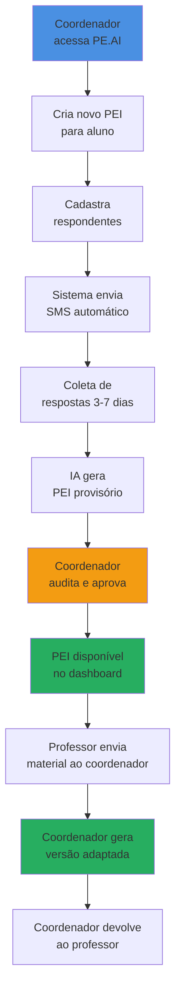
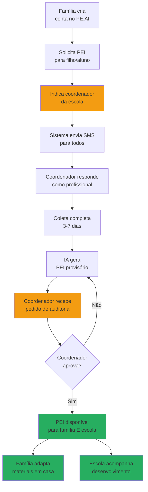
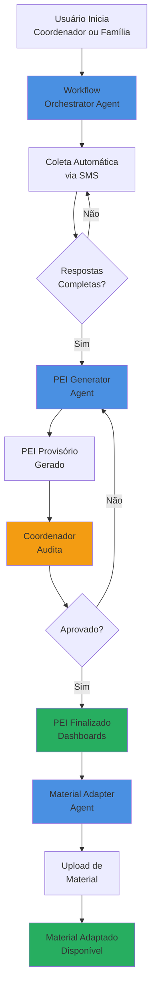
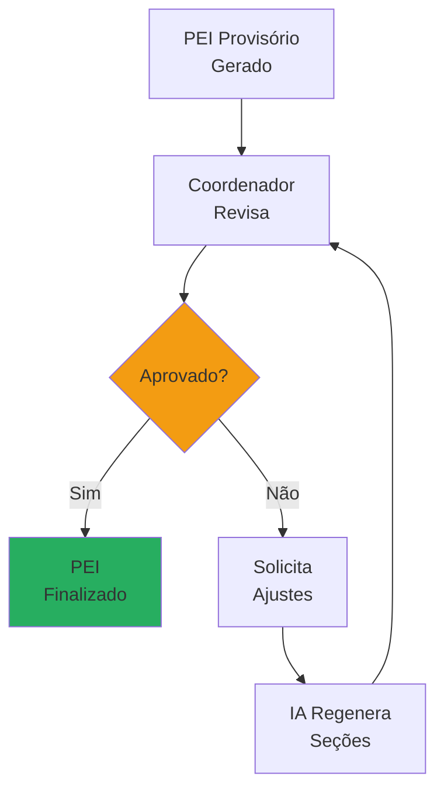
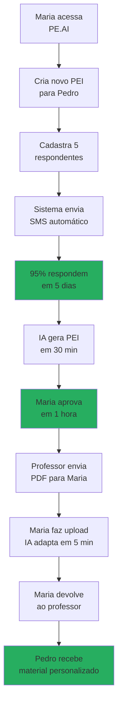
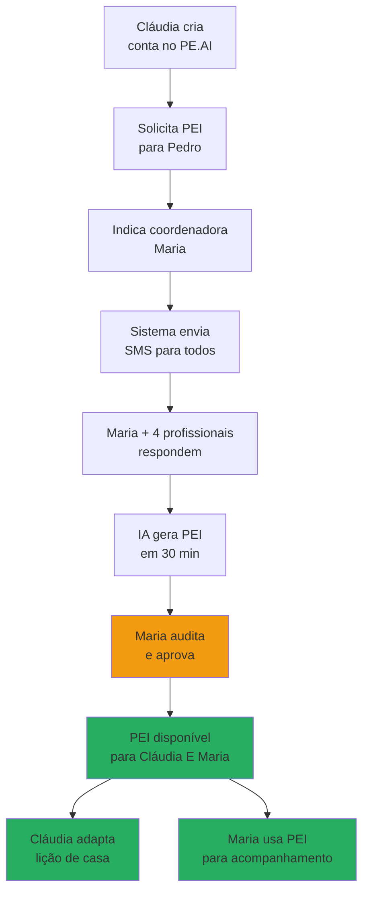

# Como Funciona o PE.AI

    

        
         
    

O PE.AI automatiza a criação e implementação do Plano Educacional Individualizado através de um sistema multiagente que reduz de semanas para dias o processo de elaboração, elimina 80% da burocracia manual e garante adaptação pedagógica personalizada em tempo real.

## Quem Usa o PE.AI?

O PE.AI foi projetado para duas realidades complementares da educação inclusiva brasileira:

### Coordenadores Pedagógicos: Escalando a Inclusão

    

        
         
    

**Quem são:** Coordenadores de escolas públicas e privadas responsáveis por elaborar e implementar PEIs para múltiplos alunos.

**Por que precisam do PE.AI:** 
- Conseguem elaborar apenas 3-5 PEIs por ano de forma manual
- Gastam semanas tentando contatar profissionais para coleta de informações
- Precisam de uma ferramenta que escale seu trabalho sem perder qualidade

**O que podem fazer:**
- Criar e gerenciar PEIs de todos os alunos da instituição
- Acompanhar em tempo real o status de cada processo de coleta
- Auditar documentos gerados pela IA antes da finalização
- Receber materiais didáticos de professores e gerar versões adaptadas
- Visualizar histórico completo de todos os alunos com NEE

**Resultados esperados:** De 3 PEIs/ano para 18 PEIs/ano, liberando tempo para acompanhamento pedagógico real.

### Famílias e Responsáveis: Autonomia e Empoderamento

    

        
         
    

**Quem são:** Pais, mães, responsáveis legais ou alunos que buscam garantir o direito ao PEI e adaptar materiais de estudo.

**Por que precisam do PE.AI:**
- Vivem em municípios sem Atendimento Educacional Especializado (568 no Brasil)
- Escola ainda não tem processo estruturado para elaborar PEI
- Desejam autonomia para adaptar materiais de reforço escolar em casa
- Precisam de suporte pedagógico que a escola não consegue oferecer

**O que podem fazer:**
- Solicitar a criação do PEI para seu filho ou para si mesmo
- Envolver profissionais que já acompanham o aluno (psicólogos, professores particulares, neurologistas)
- Fazer upload de materiais didáticos e receber versões adaptadas em minutos
- Acompanhar o desenvolvimento pedagógico ao longo do ano

**Resultados esperados:** Famílias saem da posição de espera passiva para protagonismo ativo na educação inclusiva.

:::tip[Coordenador Sempre Envolvido]
**Independente de quem inicia o processo, o coordenador pedagógico da escola sempre participa.** Isso garante validação pedagógica profissional, alinhamento com o projeto pedagógico da escola e conformidade com a Lei Brasileira de Inclusão. O PE.AI não substitui a escola: ele conecta família e instituição de forma eficiente.
:::

## Como Funciona na Prática

### Quando o Coordenador Inicia (Escola Estruturada)

Figura 1 - Jornada Iniciada pelo Coordenador

Fonte: Os autores (2025)

**Passo a passo:**

1. **Coordenador acessa dashboard:** Visão geral de todos os alunos com NEE da escola
2. **Cria novo PEI:** Insere dados do aluno (nome, NEE, laudo) e telefones dos respondentes (pais, professores, psicólogos, neurologistas)
3. **Sistema automatiza coleta:** SMS enviado automaticamente para todos, com lembretes inteligentes
4. **Acompanhamento em tempo real:** Dashboard mostra quem respondeu, quem está pendente
5. **IA gera PEI provisório:** Em 30 minutos, documento completo baseado nas respostas
6. **Auditoria humana:** Coordenador revisa, solicita ajustes se necessário, aprova
7. **PEI finalizado:** Disponível no dashboard do coordenador
8. **Uso contínuo:** Durante todo ano letivo, professores enviam materiais ao coordenador, que gera versões adaptadas e devolve

**Tempo total esperado:** 5-8 dias (vs. 10-18 semanas no processo tradicional)

### Quando a Família Inicia (Busca por Autonomia)

Figura 2 - Jornada Iniciada pela Família

Fonte: Os autores (2025)

**Passo a passo:**

1. **Família cria conta:** Acesso gratuito, cadastro simples
2. **Solicita PEI:** Preenche dados do aluno e indica nome/telefone do coordenador da escola (obrigatório)
3. **Cadastra outros profissionais:** Adiciona psicólogos, professores particulares, neurologistas que já acompanham o aluno
4. **Sistema envia SMS:** Todos recebem link do questionário, incluindo o coordenador da escola
5. **Coordenador participa:** Durante a coleta, ele responde como qualquer outro profissional
6. **IA gera PEI provisório:** Cruza informações de todas as fontes
7. **Coordenador vira auditor:** Recebe SMS com pedido de aprovação, revisa documento
8. **Aprovação:** Coordenador valida pedagogicamente o PEI
9. **Acesso duplo:** PEI aparece no dashboard da família E no dashboard do coordenador
10. **Uso compartilhado:** Família adapta materiais de reforço em casa + escola usa o PEI para acompanhamento em sala

**Tempo total esperado:** 5-8 dias + validação pedagógica garantida

:::warning[Por que o Coordenador é Obrigatório?]
A aprovação do coordenador pedagógico garante:
- **Validação profissional:** Decisões educacionais não podem ser automatizadas sem supervisão
- **Alinhamento curricular:** PEI precisa estar conectado ao projeto pedagógico da escola
- **Responsabilidade ética:** IA responsável exige auditoria humana especializada
- **Conformidade legal:** Lei 13.146/2015 (LBI) exige que a escola participe do processo
:::

### Diferença-Chave Entre os Dois Caminhos

Tabela 1 - Coordenador nos Dois Caminhos

| Aspecto | Coordenador Inicia | Família Inicia |
|---------|-------------------|----------------|
| **Quem solicita** | Coordenador da escola | Família/Responsável/Aluno |
| **Coordenador na coleta** | Não responde questionário | Responde como qualquer profissional |
| **Coordenador na auditoria** | Revisa diretamente no dashboard | Recebe SMS com pedido de aprovação |
| **Acesso ao PEI final** | Dashboard da escola | Dashboard da escola + Dashboard da família |
| **Quem gera materiais** | Coordenador (recebe de professores) | Família diretamente |
| **Ideal para** | Escolas com estrutura de Ed. Especial | Reforço domiciliar ou municípios sem AEE |

Fonte: Os autores (2025)

## Da Burocracia à Eficiência: Comparação Temporal

Tabela 2 - Comparação Temporal: Processo Tradicional vs. PE.AI

| Etapa do Processo | Tempo Tradicional | Tempo com PE.AI | Redução |
|-------------------|-------------------|-----------------|---------|
| **Contato com profissionais** | 2-3 semanas | Instantâneo | 100% |
| **Coleta de respostas** | 4-8 semanas | 3-7 dias | 80-90% |
| **Elaboração do documento PEI** | 2-4 semanas | 30 minutos | 98-99% |
| **Revisão e aprovação** | 1-2 semanas | 2-4 horas | 94-98% |
| **Adaptação de 1 material didático** | 2-3 horas | 5 minutos | 97% |
| **TEMPO TOTAL (criação do PEI)** | **10-18 semanas** | **5-8 dias** | **85-92%** |

Fonte: Estimativas baseadas em pesquisas (Os autores, 2025)

:::tip[Impacto Real]
**De 4 meses para 1 semana.** O PE.AI economiza aproximadamente **69 horas por ano letivo** para cada aluno com NEE. Em uma escola com 20 alunos, isso representa **1.380 horas economizadas** (172 dias úteis ou 34 semanas de trabalho).
:::

## Arquitetura do Sistema: Três Agentes de IA

O PE.AI utiliza três agentes especializados que trabalham de forma orquestrada. Para detalhes técnicos sobre a implementação, consulte a [documentação de tecnologia](./04_Tecnologia.md).

Figura 3 - Arquitetura do Sistema Multiagente PE.AI

Fonte: Os autores (2025)

### 1. Workflow Orchestrator Agent

    

        
         
    

**Função:** Gerencia todo o processo de coleta de informações.

**O que faz:**
- Envia SMS automaticamente para todos os respondentes (pais, professores, psicólogos, neurologistas, coordenadores)
- Monitora quem respondeu e quem está pendente em tempo real
- Dispara até 3 lembretes automáticos antes de alertar o solicitante
- Valida completude das respostas antes de acionar o próximo agente
- Quando família inicia: notifica coordenador para auditoria após PEI provisório estar pronto

**Resultados esperados:** Taxa de resposta de 95% em 7 dias vs. 60% em 4 semanas no processo manual.

Figura 4 - Tela de Acompanhamento de Respondentes

    

        
         
    

Fonte: Os autores (2025)

### 2. PEI Generator Agent

    

        
         
    

**Função:** Analisa respostas e gera o documento PEI completo.

**O que faz:**
- Cruza informações de até 5 categorias de profissionais (psicólogos, professores, neurologistas, pais, coordenadores)
- Identifica padrões de convergência entre diferentes fontes
- Gera objetivos educacionais SMART alinhados às necessidades específicas
- Propõe estratégias pedagógicas baseadas em evidências
- Recomenda tecnologias assistivas adequadas ao perfil do aluno
- Estrutura documento em conformidade com a Lei 13.146/2015 (LBI)

**Estrutura do PEI Gerado:**

Tabela 3 - Seções do PEI Automatizado

| Seção | Conteúdo |
|-------|----------|
| 1. Identificação do Estudante | Dados pessoais, NEE, laudo |
| 2. Relatório Circunstanciado | Síntese multidisciplinar |
| 3. Habilidades e Pontos Fortes | Competências identificadas |
| 4. Dificuldades e Necessidades | Barreiras específicas |
| 5. Objetivos Educacionais | Metas de curto/médio/longo prazo |
| 6. Estratégias Pedagógicas | Metodologias adaptadas |
| 7. Recursos de Apoio | Tecnologias assistivas |
| 8. Métodos de Avaliação | Critérios individualizados |

Fonte: Os autores (2025)

Figura 5 - Visualização do PEI Gerado

    

        
         
    

Fonte: Os autores (2025)

### 3. Material Adapter Agent

    

        
         
    

**Função:** Adapta materiais didáticos em tempo real.

**O que faz:**
- Analisa PDFs enviados por coordenadores (que recebem de professores) ou famílias
- Identifica tipo de conteúdo e objetivos de aprendizagem
- Consulta o PEI do aluno para identificar adaptações necessárias
- Gera versão adaptada mantendo alinhamento curricular com a turma

**Tipos de Adaptação:**

1. **Linguística:** Simplificação de vocabulário e sintaxe
2. **Estrutural:** Divisão em blocos curtos, uso de listas e tópicos
3. **Visual:** Adição de diagramas, infográficos e ilustrações
4. **Metodológica:** Conversão de teoria em práticas e contextualizações

:::warning[Preservação Curricular]
O Material Adapter Agent **não** altera objetivos de aprendizagem ou reduz rigor acadêmico. A adaptação ocorre na **forma de apresentação**, mantendo equivalência de conteúdo com a turma.
:::

**Exemplo de Adaptação:**

**Material Original (Química - 9º ano):**
> "A fotossíntese é um processo bioquímico complexo que ocorre nos cloroplastos das células vegetais, onde a energia luminosa é convertida em energia química através da síntese de moléculas de glicose a partir de dióxido de carbono e água."

**Material Adaptado (aluno com TDAH e dislexia):**
> **O que é Fotossíntese?**
> 
> É assim que as plantas "comem"!
> 
> **Como funciona:**
> 1. A planta pega luz do sol
> 2. Usa água e gás carbônico (do ar)
> 3. Transforma tudo em comida (açúcar)
> 
> **Onde acontece:** Dentro das folhas verdes
> 
> **Atividade prática:** Vamos colocar uma planta no escuro e outra na luz. O que você acha que vai acontecer?

Figura 6 - Interface de Upload de Material

    

        
         
    

Fonte: Os autores (2025)

## Auditoria Humana: IA Responsável

:::tip[Princípio de IA Responsável]
Seguindo as diretrizes do hackathon (Célia Cruz e Dani Matielo), o PE.AI implementa **"abrir a caixa preta"**: o auditor visualiza as fontes da IA para cada seção do PEI e pode solicitar ajustes específicos.
:::

Após o PEI Generator produzir o documento provisório, um coordenador pedagógico sempre revisa antes da finalização. Isso garante:

- **Responsabilidade ética** em decisões educacionais
- **Validação contextual** da realidade da escola
- **Detecção de vieses** da IA
- **Conformidade legal** completa

Figura 7 - Fluxo de Auditoria

Fonte: Os autores (2025)

## Interface do Coordenador

Dashboard intuitivo com 4 funcionalidades principais:

**1. Visão Geral**
- Métricas em cards: PEIs em coleta, em revisão, validados, expirados
- Atalho rápido "Criar novo PEI"

Figura 8 - Dashboard Principal

    

        
         
    

Fonte: Os autores (2025)

**2. Gestão de Alunos**
- Lista com filtros por série/ano
- Status em tempo real
- Ações rápidas: Gerar aula adaptada, Reenviar formulário, Ver PEI

Figura 9 - Lista de Alunos

    

        
         
    

Fonte: Os autores (2025)

**3. Criação de Novo PEI**
Processo em 4 passos:
1. Informações do aluno (nome, NEE, laudo)
2. Cadastro de respondentes (pais, professores, especialistas)
3. Revisão e confirmação
4. Envio automático de SMS

Figura 10 - Formulário de Criação

    

        
         
    

Fonte: Os autores (2025)

**4. Histórico do Aluno**
- Dados completos do aluno
- Materiais adaptados (download disponível)
- Status do PEI e respondentes
- Linha do tempo de atualizações

## Casos de Uso: Jornadas Completas

### Caso 1: Maria, Coordenadora em São Paulo

**Contexto:** Maria coordena escola municipal com 18 alunos com NEE. Pedro (9 anos, TDAH + dislexia) acaba de ingressar.

Figura 11 - Jornada de Maria

Fonte: Os autores (2025)

**Resultados esperados:** 5 dias vs. 10-18 semanas. Maria consegue elaborar PEIs para os 18 alunos no primeiro semestre.

### Caso 2: Cláudia, Mãe de Pedro em Município sem AEE

**Contexto:** Cláudia vive em município sem Atendimento Educacional Especializado. A escola de Pedro não tem processo estruturado para PEI.

Figura 12 - Jornada de Cláudia

Fonte: Os autores (2025)

**Resultados esperados:** Cláudia sai da posição de espera passiva. Mesmo em município sem AEE, Pedro tem PEI validado e materiais adaptados. A escola passa a acompanhá-lo melhor.

## Vantagens Competitivas

Tabela 4 - Comparação Final

| Aspecto | Processo Tradicional | Com PE.AI | Ganho Esperado |
|---------|---------------------|-----------|----------------|
| Tempo de elaboração | 10-18 semanas | 5-8 dias | 85-92% |
| Tempo do coordenador | 15 horas | 2 horas | 87% |
| Taxa de resposta | ~60% | ~95% | +58% |
| Adaptação de material | 2-3 horas | 5 minutos | 97% |
| Conformidade LBI | Variável | 100% | Garantida |
| Acesso em municípios sem AEE | 0% | 100% | Democratização total |

Fonte: Estimativas baseadas em pesquisas (Os autores, 2025)

**Diferenciais:**
1. **Automação + Supervisão Humana:** Eficiência sem perder responsabilidade ética
2. **Zero Cadastro para Respondentes:** Profissionais acessam via SMS, sem criar conta
3. **Gestão Proativa:** Lembretes e alertas automáticos
4. **Uso Contínuo:** Adaptação de materiais durante todo ano letivo
5. **Escalabilidade Total:** Do nível familiar ao estadual
6. **Dois Caminhos:** Escola estruturada OU família autônoma

## Conclusão

O PE.AI transforma três gargalos sistêmicos:

1. **Coleta de informações:** De descentralizada para automatizada
2. **Elaboração do PEI:** De burocrática para inteligente
3. **Implementação prática:** De manual para personalizada

O resultado esperado é um sistema educacional mais inclusivo, eficiente e alinhado com a Lei Brasileira de Inclusão, onde a tecnologia amplifica a capacidade humana de promover educação de qualidade para todos.

**Seja através do coordenador ou da família, o PE.AI garante que nenhum aluno fique sem o suporte que a lei lhe garante.**