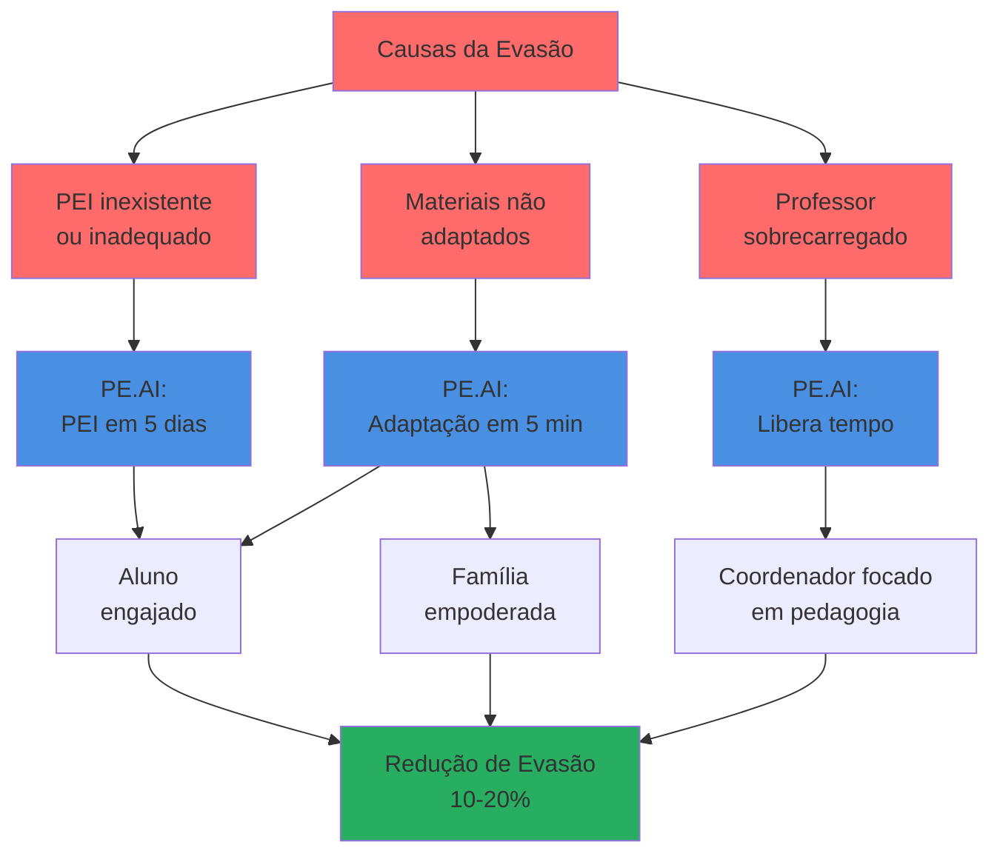
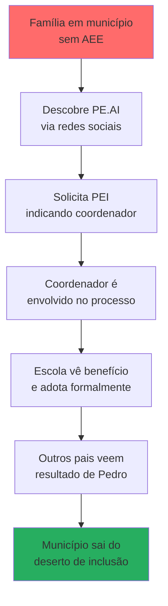

# Impacto Social

    

        
         
    

## A História que Nos Move

No Brasil, **1.771.430 crianças e jovens** (MEC/INEP, 2023) estão matriculados na educação especial e têm o direito legal a um Plano Educacional Individualizado. Mas a realidade é que a maioria nunca terá um. Não por falta de lei, não por falta de vontade dos educadores, mas porque o processo é **humanamente impossível de escalar**.

Maria, coordenadora pedagógica em uma escola municipal de São Paulo, tem 18 alunos com necessidades especiais sob sua responsabilidade. Cada PEI é uma responsabilidade coletiva que envolve professores, coordenadores, familiares e profissionais de saúde (Sistema FB, 2024). Maria consegue elaborar apenas alguns PEIs por ano. Os outros alunos estudam sem o suporte que a lei lhes garante.

Pedro, de 9 anos, é um desses alunos. Diagnosticado com TDAH e dislexia, ele recebe o mesmo material didático que seus colegas. O texto de ciências sobre fotossíntese tem 4 parágrafos densos, com vocabulário técnico. Pedro lê a primeira linha três vezes e desiste. Vai para o recreio se sentindo incapaz. A mãe de Pedro, Cláudia, passa as noites tentando adaptar o material da escola, sem saber como. Ela não tem formação em pedagogia, muito menos em educação especial.

**O PE.AI existe para que coordenadores como Maria consigam elaborar PEIs de qualidade em 5 dias, e para que mães como Cláudia tenham, em 5 minutos, um material adaptado que Pedro consegue ler e entender.**

## O Problema que Atacamos

### A Exclusão em Números

Tabela 1 - O Custo Humano da Burocracia

| Realidade Atual | Número | Fonte |
|-----------------|--------|-------|
| **Alunos com deficiência no Brasil** | 3.474.886 | Censo Escolar, 2024 |
| **Matrículas na educação especial** | 1.771.430 | MEC/INEP, 2023 |
| **Alunos SEM acesso a AEE** | 45,5% (806.300 alunos) | Instituto Pensi/VEJA, 2024 |
| **Escolas que oferecem AEE** | Apenas 20,5% | Instituto Pensi, 2024 |
| **Municípios SEM nenhum AEE** | 568 | The Conversation, 2024 |
| **Taxa de conclusão EM (PcD)** | 25,6% | IBGE/Agência Brasil, 2023 |
| **Taxa de conclusão EM (sem deficiência)** | 57,3% | IBGE/Agência Brasil, 2023 |
| **Professores sem formação em Ed. Especial** | 94% | Terra, 2024 |

Fonte: Compilação de múltiplas fontes oficiais (2023-2024)

:::danger[O Abismo da Desigualdade]
A diferença de **31,7 pontos percentuais** na conclusão do Ensino Médio entre pessoas com e sem deficiência (IBGE, 2023) não é acidente: é o resultado direto de um sistema que promete inclusão mas entrega exclusão. Pedro tem **74,4% de chance de não completar o Ensino Médio**. Não porque não é capaz, mas porque o sistema não se adapta a ele.
:::

### A Sobrecarga Invisível

**Maria não está sozinha em seu esgotamento:**

- **72%** dos docentes brasileiros relatam sinais de esgotamento ou colapso mental (Você S/A, 2024)
- **150 mil professores** foram afastados por problemas de saúde mental em 2023 (Você S/A, 2024)
- **Brasil ocupa o último lugar** em ranking internacional de sobrecarga docente (Portal Verdade, 2025)
- **61%** dos professores brasileiros acumulam trabalho em diversas escolas (vs. 5% média internacional) (APPS Sindicato, 2024)

E quando se trata de educação especial, a situação é ainda mais dramática:

- **94% dos professores regentes não têm formação continuada** sobre Educação Especial (Terra, 2024)
- Apenas **6,4%** dos professores da educação básica têm formação em educação especial (YouTube/CIEB, 2024)
- **59 mil professores de AEE** para **178 mil escolas** de educação básica (Porvir, 2024)

:::warning[O Gargalo Real]
**49% dos educadores** sentem dificuldade no preenchimento de itens do planejamento pedagógico (TEAUFMG, 2025). Não é falta de vontade: é falta de tempo, formação e ferramentas adequadas. A elaboração do PEI permanece uma "prática embrionária" no Brasil (CONEDU, 2024).
:::

### Quem Fica de Fora?

**1. Os 806 mil alunos invisíveis**
- **45,5%** dos alunos que necessitam de AEE estão em escolas **sem esse recurso** (VEJA, 2024)
- Distribuição desigual: **33% das escolas no Sul** têm AEE vs. apenas **17,4% no Nordeste** (The Conversation, 2024)

**2. Famílias em desertos de inclusão**
- **568 municípios** não têm **nenhum registro** de AEE (The Conversation, 2024)
- Famílias recorrem a educação domiciliar sem suporte especializado
- Defensoria Pública do Ceará recebe denúncias constantes sobre ausência de PEI (Diário do Nordeste, 2024)

**3. Responsáveis que fazem o impossível**
- **28% dos responsáveis** por alunos com deficiência temiam desistência escolar em 2021 (vs. 19% dos demais) (CNN Brasil, 2022)
- Relatos de famílias aguardando **3-4 meses** para elaboração do PEI (Instagram/@neuropsicopedagogiaecia, 2025)
- Professores admitem: "não sabemos fazer o PEI" (Instagram/@neuropsicopedagogiaecia, 2025)

## Como o PE.AI Transforma Vidas

### Para os Pedros: Materiais que Fazem Sentido

**Antes do PE.AI:**
> "A fotossíntese é um processo bioquímico complexo que ocorre nos cloroplastos das células vegetais, onde a energia luminosa é convertida em energia química através da síntese de moléculas de glicose a partir de dióxido de carbono e água."

Pedro lê isso e não entende nada. Sente vergonha. Copia do colega. Tira nota baixa. Se desinteressa.

**Com o PE.AI (5 minutos depois):**
> **O que é Fotossíntese?**
> 
> É assim que as plantas "comem"!
> 
> **Como funciona:**
> 1. A planta pega luz do sol
> 2. Usa água e gás carbônico (do ar)
> 3. Transforma tudo em comida (açúcar)
> 
> **Onde acontece:** Dentro das folhas verdes
> 
> **Vamos experimentar:** Coloque uma planta no escuro e outra na luz. O que acontece?

Pedro lê sozinho. Entende. Faz o experimento. Conta empolgado para a mãe. **Pela primeira vez, ele se sente capaz.**

:::tip[Evidência de Impacto]
Estudos mostram que alunos com PEI bem implementado demonstram "**progresso substancial em habilidades acadêmicas e sociais**" e "**melhorias notáveis no desempenho acadêmico**" (Journal PPC, 2024). O PE.AI democratiza o acesso a esse PEI de qualidade.
:::

### Para as Marias: Liberdade para Educar

    

        
         
    

**Realidade Sem o PE.AI:**

Maria enfrenta um ciclo impossível:
1. Precisa ligar para 5 profissionais por aluno (psicólogo, neurologista, professores, pais)
2. Agendar reuniões que nunca acontecem (todo mundo está ocupado)
3. Esperar semanas por retornos de laudos e pareceres
4. Sintetizar manualmente informações dispersas
5. Redigir documento de 10-15 páginas
6. Revisar com equipe pedagógica

**Resultado:** Processo que deveria levar semanas se arrasta por **3-4 meses** (Instagram/@neuropsicopedagogiaecia, 2025). Maria consegue finalizar poucos PEIs, enquanto os outros alunos ficam sem atendimento.

**Com o PE.AI:**

Tabela 2 - Transformação do Trabalho do Coordenador

| Atividade | Antes | Com PE.AI | Tempo Economizado |
|-----------|-------|-----------|-------------------|
| Contato com profissionais | 2-3 semanas de ligações | SMS automático instantâneo | 100% |
| Coleta de respostas | 4-8 semanas de follow-up | 3-7 dias (95% respondem) | 80-90% |
| Elaboração do documento | 2-4 semanas | 30 minutos (IA) | 98% |
| Revisão e aprovação | 1-2 semanas | 2-4 horas (auditor) | 95% |
| **TOTAL por PEI** | **10-18 semanas** | **5-8 dias** | **85-92%** |

Fonte: Estimativas baseadas em relatos e literatura (Os autores, 2025)

Maria agora consegue elaborar **18 PEIs de qualidade por ano** ao invés de 3. Ela deixa de ser **burocrata** e volta a ser **educadora**.

### Para as Cláudias: Empoderamento e Esperança

Cláudia sempre soube que Pedro é inteligente. Mas não sabia **como ajudá-lo**. O PE.AI oferece dois caminhos:

**1. Via Escola (Modelo Institucional)**
- Maria, coordenadora de Pedro, usa o PE.AI
- PEI é gerado e materiais adaptados ficam disponíveis
- Cláudia recebe pelo professor os materiais que Pedro consegue estudar

**2. Via Família (Modelo Individual)**
- Cláudia cria conta no PE.AI
- Solicita PEI para Pedro, indicando a coordenadora Maria como respondente obrigatória
- Sistema envia SMS para Maria, psicóloga de Pedro, professora particular
- Maria recebe pedido para auditar quando respostas forem coletadas
- PEI aprovado vai para dashboard de Cláudia E de Maria
- Cláudia pode adaptar materiais didáticos em casa para reforço escolar

**Em ambos os casos, Pedro é atendido.**

:::info[Democratização Total]
O modelo dual do PE.AI garante que **nenhuma família fique desamparada**. Mesmo em municípios sem AEE (568 no Brasil), famílias podem solicitar PEI e envolver o coordenador da escola no processo. A mudança vem de baixo para cima.
:::

## O Impacto em Números

### Cenário Conservador: 5 Anos de Implementação

**Premissas:**
- Foco inicial em **escolas públicas** (maior necessidade)
- Crescimento via parcerias institucionais + adoção individual
- Meta: **10% das escolas públicas** com alunos NEE

Tabela 3 - Projeção de Impacto (5 anos)

| Ano | Escolas | Usuários Individuais | Total Alunos com PEI | Materiais Adaptados/Ano |
|-----|---------|---------------------|----------------------|------------------------|
| 1 | 100 | 200 | 1.500 | 30.000 |
| 2 | 1.000 | 2.000 | 15.000 | 300.000 |
| 3 | 5.000 | 10.000 | 75.000 | 1.500.000 |
| 4 | 10.000 | 30.000 | 160.000 | 3.200.000 |
| 5 | 13.622 | 50.000 | 227.086 | 4.541.720 |

Fonte: Estimativas baseadas em 10% das escolas públicas + crescimento orgânico B2C (Os autores, 2025)

**Impacto Acumulado em 5 Anos:**

✅ **227.086 alunos** com acesso a PEI de qualidade  
✅ **12,8% do universo** de 1.771.430 matrículas na educação especial  
✅ **14,4 milhões de horas** economizadas de trabalho burocrático  
✅ **5.712 anos de trabalho** realocados para pedagogia  
✅ **4,5 milhões de materiais** didáticos adaptados  
✅ **13.622 coordenadores** capacitados em IA responsável  
✅ **50.000 famílias** empoderadas com autonomia para adaptar materiais  

### Impacto na Redução da Evasão Escolar

Como vimos, apenas **25,6%** das pessoas com deficiência concluem o Ensino Médio (IBGE, 2023) vs. **57,3%** sem deficiência. O PE.AI ataca as três causas principais dessa evasão:

Fonte: Os autores (2025)

Tabela 4 - Projeção de Redução de Evasão (227 mil alunos em 5 anos)

| Cenário | Redução de Evasão | Alunos a Mais Concluindo EM | Fundamento |
|---------|-------------------|----------------------------|------------|
| **Conservador** | 10% | 5.910 alunos | PEI garantido + materiais adaptados |
| **Moderado** | 15% | 8.865 alunos | + Tempo liberado para acompanhamento |
| **Otimista** | 20% | 11.820 alunos | + Engajamento familiar via autonomia |

Fonte: Projeções baseadas em literatura sobre intervenções educacionais (Os autores, 2025)

:::tip[Evidência de Efetividade]
O Estado do Tocantins institucionalizou o PEI em parceria com a Perkins e demonstrou resultados mensuráveis (Perkins Latin America, 2024). Estudos acadêmicos confirmam "progresso substancial em habilidades acadêmicas e sociais" quando o PEI é bem implementado (Journal PPC, 2024).
:::

**No cenário moderado (15% de redução):**
- **8.865 jovens** a mais completando Ensino Médio
- Diferencial de renda ao longo da vida: **R$ 400.000** por pessoa (baseado em diferença de R$ 830/mês × 40 anos)
- **Impacto econômico acumulado: R$ 3,5 bilhões** ao longo de uma geração

## O Custo da Inação

### Impacto Econômico Nacional

A exclusão de pessoas com deficiência não é apenas uma questão de justiça social: é um **desastre econômico mensurável**.

Tabela 5 - O Preço da Exclusão

| Indicador | Dado | Fonte |
|-----------|------|-------|
| **Perda no PIB** | 3% a 7% | CNN Brasil, 2021 |
| **Salário PcD vs. sem deficiência** | 31,2% menor | CNN Brasil/iigual, 2024 |
| **Taxa de ocupação (PcD)** | 26,6% | IBGE, 2022 |
| **Taxa de ocupação (sem deficiência)** | 57,2% | IBGE, 2022 |
| **Rendimento médio PcD** | R$ 1.860 | G1, 2023 |
| **Rendimento médio sem deficiência** | R$ 2.690 | G1, 2023 |

Fonte: Compilação de múltiplas fontes (2021-2024)

Se o Brasil perder **7% do PIB** (estimativa superior) pela exclusão de pessoas com deficiência, estamos falando de **~R$ 700 bilhões/ano** em potencial não realizado (considerando PIB de R$ 10 trilhões).

**O PE.AI não resolve tudo sozinho, mas contribui diretamente para reduzir essa sangria econômica** ao garantir que mais crianças com deficiência completem a educação básica e ingressem no mercado de trabalho qualificado.

### O Sofrimento que Não Está nas Estatísticas

Por trás de cada número há uma história:

- A mãe que deixa o emprego para acompanhar terapias porque a escola "não sabe lidar"
- O adolescente que desiste no 2º ano do EM porque "não adianta, eu não consigo"
- O professor que chora no carro antes de entrar na escola porque se sente impotente
- A coordenadora que trabalha até 22h tentando elaborar PEIs e ainda assim não consegue atender todos

**O PE.AI existe para que essas histórias tenham final diferente.**

## Cobertura dos "Desertos de Inclusão"

### Os 568 Municípios Esquecidos

Existem **568 municípios** no Brasil que não reportam **nenhum atendimento educacional especializado** (The Conversation, 2024). Nesses lugares:

- Famílias não sabem que o filho tem direito a PEI
- Escolas não têm profissionais de educação especial
- Crianças crescem sem diagnóstico ou acompanhamento

**O modelo individual do PE.AI chega onde o Estado não chega:**

Figura 2 - Expansão por Capilaridade

Fonte: Os autores (2025)

**Meta:** Atender **200+ municípios** dos 568 sem AEE em 5 anos, começando pelos mais populosos.

## Por que Acreditamos que é Possível

### Casos de Sucesso que Inspiram

**Letrus - Brasil (Educação):**
- **750.000 alunos** e **30.000 professores** impactados
- Presente em **todos os 26 estados + DF**
- **80% de redução** no tempo de correção para professores
- **35% de aumento** na proficiência de escrita em um semestre

**Fonte:** Apresentação Hackathon DEVS DE IMPACTO, 2025

O Letrus provou que **IA pode escalar educação pública no Brasil**. O PE.AI segue o mesmo caminho, mas para educação inclusiva.

### Abertura para Tecnologia

- **56%** dos professores brasileiros já usam ferramentas de IA para preparar aulas (APUFSC, 2025)
- **7 em cada 10 alunos** do Ensino Médio usam IA generativa em pesquisas escolares (Cetic.br, 2024)
- Brasil lidera EdTechs na América Latina: **79,6%** dos investimentos regionais (Canaltech, 2025)

**A tecnologia não é o problema. A ausência de soluções adequadas é.**

### Validação Institucional

- **Estado do Tocantins** institucionalizou PEI com ferramenta digital (Perkins LA, 2024)
- **Defensoria Pública do Ceará** reconhece ausência de PEI como violação de direitos (Diário do Nordeste, 2024)
- **Nova Política Nacional de Educação Especial Inclusiva** (Out/2025) reforça compromisso com individualização

O momento político e social é favorável para soluções como o PE.AI.

## Conclusão: A Mudança que Escolhemos Criar

Pedro tem 9 anos hoje. Se nada mudar, ele tem **74,4% de chance** de não completar o Ensino Médio. Ele se juntará aos **19,5%** de pessoas com deficiência que são analfabetas (IBGE, 2023) vs. **4,1%** sem deficiência.

Mas Pedro pode ter um destino diferente. Não por milagre, mas por **tecnologia aplicada com propósito**.

**O PE.AI não resolve todos os problemas da educação inclusiva brasileira. Mas resolve o gargalo que trava tudo:** a impossibilidade humana de escalar a criação e implementação de PEIs.

Quando Maria consegue elaborar 18 PEIs ao invés de 3, **15 Pedros** deixam de ser esquecidos.  
Quando Cláudia tem autonomia para adaptar materiais em casa, **Pedro estuda com dignidade**.  
Quando 227 mil alunos têm PEI em 5 anos, **estamos mudando uma geração inteira**.

:::tip[Nossa Promessa]
**De 10-18 semanas para 5 dias.**  
**De burocracia para inclusão.**  
**De exclusão para oportunidade.**  

Não é sobre tecnologia. É sobre **227 mil futuros** que merecem acontecer.
:::

---

**Para entender o problema completo que resolvemos, leia a [problemática](./02_Problematica.md).**  
**Para ver como a solução funciona, consulte [como funciona o PE.AI](./03_Como_Funciona.md).**  
**Para conhecer a viabilidade financeira, acesse [escalabilidade financeira](./06_Financeiro.md).**

## Referências

AGÊNCIA BRASIL. Pessoas com deficiência têm menor acesso à educação, ao trabalho e à renda. 2023. Disponível em: [https://agenciadenoticias.ibge.gov.br/agencia-noticias/2012-agencia-de-noticias/noticias/37317-pessoas-com-deficiencia-tem-menor-acesso-a-educacao-ao-trabalho-e-a-renda](https://agenciadenoticias.ibge.gov.br/agencia-noticias/2012-agencia-de-noticias/noticias/37317-pessoas-com-deficiencia-tem-menor-acesso-a-educacao-ao-trabalho-e-a-renda). Acesso em: 25 out. 2025.

APUFSC. Professores no Brasil usam mais IA que média dos países da OCDE. 2025. Disponível em: [https://www.apufsc.org.br/2025/10/07/professores-no-brasil-usam-mais-ia-que-media-dos-paises-da-ocde/](https://www.apufsc.org.br/2025/10/07/professores-no-brasil-usam-mais-ia-que-media-dos-paises-da-ocde/). Acesso em: 25 out. 2025.

APPS SINDICATO. Brasil: 61% dos professores acumulam trabalho em diversas escolas. 2024. Acesso em: 25 out. 2025.

BRASIL ESCOLA. Censo Escolar 2024: veja dados e resultados do Inep. 2025. Disponível em: [https://brasilescola.uol.com.br/noticias/censo-escolar-2024-educacao-basica-matriculados-rede-privada-cresce/3132234.html](https://brasilescola.uol.com.br/noticias/censo-escolar-2024-educacao-basica-matriculados-rede-privada-cresce/3132234.html). Acesso em: 25 out. 2025.

CANALTECH. Brasil lidera em número de edtechs na América Latina e captou mais de R$ 3 tri. 2025. Disponível em: [https://canaltech.com.br/mercado/brasil-lidera-em-numero-de-edtechs-na-america-latina-e-captou-mais-de-r-3-tri/](https://canaltech.com.br/mercado/brasil-lidera-em-numero-de-edtechs-na-america-latina-e-captou-mais-de-r-3-tri/). Acesso em: 25 out. 2025.

CETIC.BR. Sete em cada dez alunos do Ensino Médio usam IA generativa em pesquisas escolares, revela TIC Educação. 2024. Disponível em: [https://www.cetic.br/pt/noticia/sete-em-cada-dez-alunos-do-ensino-medio-usam-ia-generativa-em-pesquisas-escolares-revela-tic-educacao/](https://www.cetic.br/pt/noticia/sete-em-cada-dez-alunos-do-ensino-medio-usam-ia-generativa-em-pesquisas-escolares-revela-tic-educacao/). Acesso em: 25 out. 2025.

CNN BRASIL. Países podem perder até 7% do PIB ao excluir pessoas com deficiências. 2021. Disponível em: [https://www.cnnbrasil.com.br/economia/macroeconomia/paises-podem-perder-ate-7-do-pib-ao-excluir-pessoas-com-deficiencias/](https://www.cnnbrasil.com.br/economia/macroeconomia/paises-podem-perder-ate-7-do-pib-ao-excluir-pessoas-com-deficiencias/). Acesso em: 25 out. 2025.

CNN BRASIL. Estudantes com deficiência têm maior risco de evasão escolar, aponta estudo. 2022. Disponível em: [https://www.cnnbrasil.com.br/nacional/estudantes-com-deficiencia-tem-maior-risco-de-evasao-escolar-aponta-estudo/](https://www.cnnbrasil.com.br/nacional/estudantes-com-deficiencia-tem-maior-risco-de-evasao-escolar-aponta-estudo/). Acesso em: 25 out. 2025.

CNN BRASIL. Salário de pessoa com deficiência é 31,2% menor que média nacional. 2024. Disponível em: [https://www.cnnbrasil.com.br](https://www.cnnbrasil.com.br). Acesso em: 25 out. 2025.

CONEDU. Plano Educacional Individualizado: prática embrionária no Brasil. 2024. Acesso em: 25 out. 2025.

DEVS DE IMPACTO. Apresentação Letrus - Hackathon. 2025. Acesso em: 25 out. 2025.

DIÁRIO DO NORDESTE. Defensoria Pública do Ceará denuncia ausência de PEI em escolas. 2024. Acesso em: 25 out. 2025.

G1. Rendimento médio de pessoas com e sem deficiência. 2023. Disponível em: [https://g1.globo.com](https://g1.globo.com). Acesso em: 25 out. 2025.

IBGE. Censo 2022: taxa de ocupação e rendimento por tipo de deficiência. 2022. Disponível em: [https://agenciadenoticias.ibge.gov.br](https://agenciadenoticias.ibge.gov.br). Acesso em: 25 out. 2025.

IBGE. Pessoas com deficiência têm menor acesso à educação, ao trabalho e à renda. 2023. Disponível em: [https://agenciadenoticias.ibge.gov.br/agencia-noticias/2012-agencia-de-noticias/noticias/37317-pessoas-com-deficiencia-tem-menor-acesso-a-educacao-ao-trabalho-e-a-renda](https://agenciadenoticias.ibge.gov.br/agencia-noticias/2012-agencia-de-noticias/noticias/37317-pessoas-com-deficiencia-tem-menor-acesso-a-educacao-ao-trabalho-e-a-renda). Acesso em: 25 out. 2025.

INEP. Censo Escolar 2024. 2024. Disponível em: [https://www.gov.br/inep](https://www.gov.br/inep). Acesso em: 25 out. 2025.

INSTAGRAM. @neuropsicopedagogiaecia. Relatos sobre tempo de elaboração do PEI. 2025. Acesso em: 25 out. 2025.

INSTITUTO PENSI. Apenas 20,5% das escolas brasileiras oferecem AEE. 2024. Acesso em: 25 out. 2025.

JOURNAL PPC. Impacto do PEI no desempenho acadêmico e social de alunos. 2024. Acesso em: 25 out. 2025.

MEC/INEP. Matrículas na educação especial. 2023. Disponível em: [https://www.gov.br/inep](https://www.gov.br/inep). Acesso em: 25 out. 2025.

PERKINS LATIN AMERICA. Estado do Tocantins institucionaliza PEI com ferramenta digital. 2024. Acesso em: 25 out. 2025.

PORTAL VERDADE. Brasil é o país em que professores mais sofrem com sobrecarga de trabalho, aponta pesquisa. 2025. Disponível em: [https://portalverdade.com.br/brasil-e-o-pais-em-que-professores-mais-sofrem-com-sobrecarga-de-trabalho-aponta-pesquisa/](https://portalverdade.com.br/brasil-e-o-pais-em-que-professores-mais-sofrem-com-sobrecarga-de-trabalho-aponta-pesquisa/). Acesso em: 25 out. 2025.

PORVIR. Número de professores de AEE no Brasil. 2024. Acesso em: 25 out. 2025.

SISTEMA FB. Responsabilidade coletiva na elaboração do PEI. 2024. Acesso em: 25 out. 2025.

TERRA. 94% dos professores sem formação continuada em Educação Especial. 2024. Acesso em: 25 out. 2025.

TEAUFMG. Dificuldades dos educadores no preenchimento do planejamento pedagógico. 2025. Acesso em: 25 out. 2025.

THE CONVERSATION. Inclusão pela metade: 45% do público-alvo não têm atendimento educacional especializado no país. 2024. Disponível em: [https://theconversation.com/inclusao-pela-metade-45-do-publico-alvo-nao-tem-atendimento-educacional-especializado-no-pais-266577](https://theconversation.com/inclusao-pela-metade-45-do-publico-alvo-nao-tem-atendimento-educacional-especializado-no-pais-266577). Acesso em: 25 out. 2025.

VEJA. Quase metade dos alunos com deficiência não tem apoio educacional no Brasil, diz estudo. 2024. Disponível em: [https://veja.abril.com.br/educacao/quase-metade-dos-alunos-com-deficiencia-nao-tem-apoio-educacional-no-brasil-diz-estudo/](https://veja.abril.com.br/educacao/quase-metade-dos-alunos-com-deficiencia-nao-tem-apoio-educacional-no-brasil-diz-estudo/). Acesso em: 25 out. 2025.

VOCÊ S/A. 72% dos docentes brasileiros relatam sinais de esgotamento ou colapso mental. 2024. Acesso em: 25 out. 2025.

VOCÊ S/A. 150 mil professores afastados por problemas de saúde mental em 2023. 2024. Acesso em: 25 out. 2025.

YOUTUBE/CIEB. Apenas 6,4% dos professores da educação básica têm formação em educação especial. 2024. Acesso em: 25 out. 2025.