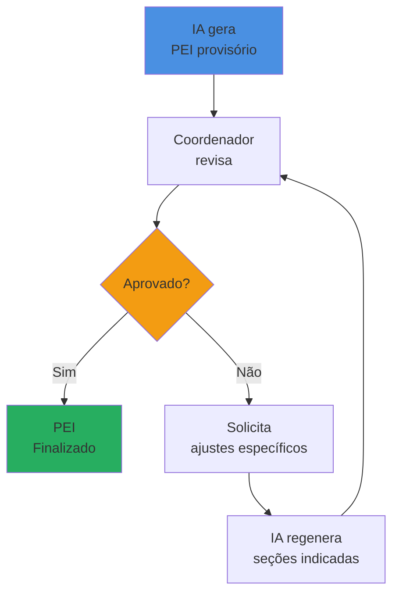

# Agentes de IA e Stack

    

        
         
    

## Por Que IA Multi-Agente?

A elaboração de um PEI não é uma tarefa linear. É um processo complexo que envolve:

- **Coordenação temporal:** Coletar informações de múltiplas fontes em momentos diferentes
- **Síntese interdisciplinar:** Cruzar perspectivas de pais, professores, psicólogos, neurologistas
- **Validação humana:** Garantir que decisões educacionais tenham supervisão profissional
- **Adaptação contínua:** Transformar materiais didáticos ao longo de todo o ano letivo

Tentamos resolver isso com um único modelo de IA. **Não funcionou.** A IA confundia etapas, misturava responsabilidades e, pior, não garantia auditoria humana adequada.

A solução foi **especialização**: três agentes de IA, cada um com uma responsabilidade clara, trabalhando de forma orquestrada. Assim como uma equipe multidisciplinar funciona melhor que um profissional sozinho, nossos agentes entregam resultados que nenhum modelo único conseguiria.

:::tip[IA Responsável por Design]
Seguindo as diretrizes do hackathon (Célia Cruz e Dani Matielo), o PE.AI implementa **"abrir a caixa preta"**: cada decisão da IA é rastreável até suas fontes originais, e um humano sempre tem a palavra final. Não é automação cega. É amplificação inteligente do trabalho humano.
:::

## Os Três Agentes de IA

### 1. Workflow Orchestrator Agent: O Coordenador Incansável

    

        
         
    

**O Problema que Resolve:**

Maria, coordenadora em São Paulo, gasta **2-3 semanas** só tentando contatar profissionais para coletar informações do PEI. Ela liga, manda e-mail, deixa recado. Muitos não respondem. Ela não sabe quem recebeu, quem leu, quem esqueceu.

**O que Este Agente Faz:**

O Workflow Orchestrator é o "gerente de projeto" do PE.AI. Ele:

1. **Envia SMS automaticamente** para todos os respondentes no momento exato que o PEI é criado
2. **Monitora em tempo real** quem respondeu e quem está pendente
3. **Dispara lembretes inteligentes** (3 tentativas automáticas antes de alertar o solicitante)
4. **Valida completude** das respostas antes de acionar o próximo agente
5. **Notifica o coordenador** quando PEI provisório está pronto para auditoria

**Por Que Funciona:**

- **Zero fricção para respondentes:** Recebem SMS com link direto, sem precisar criar conta ou baixar app
- **Persistência sem ser invasivo:** Lembretes espaçados em 48h evitam spam mas garantem visibilidade
- **Transparência total:** Dashboard mostra status em tempo real para quem solicitou o PEI

**Tecnologia por Trás:**

- **LangGraph** para gerenciar estados complexos do fluxo de trabalho
- **Twilio** para envio massivo de SMS com rastreamento de entrega
- **Sistema de eventos assíncronos** que dispara ações baseadas em tempo (lembretes) ou eventos (resposta completa)

**Resultados Esperados:**

Taxa de resposta de **95% em 7 dias** vs. **60% em 4 semanas** no processo manual.

Figura 1 - Dashboard de Monitoramento em Tempo Real

    

        
         
    

Fonte: Os autores (2025)

### 2. PEI Generator Agent: O Sintetizador Pedagógico

    

        
         
    

**O Problema que Resolve:**

Quando Maria finalmente consegue coletar todas as informações, ela precisa ler 5 documentos diferentes, identificar convergências e divergências, sintetizar em um relatório coerente, propor objetivos educacionais alinhados à BNCC e estruturar tudo em conformidade com a Lei 13.146/2015. **Isso leva 2-4 semanas.**

**O que Este Agente Faz:**

O PEI Generator é o "pedagogo especialista" do sistema. Ele:

1. **Cruza informações** de até 5 fontes diferentes (pais, professores, psicólogos, neurologistas, coordenadores)
2. **Identifica padrões de convergência:** O que diferentes profissionais concordam sobre o aluno?
3. **Detecta divergências importantes:** Quando há contradições, sinaliza para auditoria humana
4. **Gera objetivos SMART:** Metas específicas, mensuráveis, alcançáveis, relevantes e temporais
5. **Propõe estratégias pedagógicas** baseadas em evidências científicas de educação especial
6. **Recomenda tecnologias assistivas** adequadas ao perfil específico do aluno
7. **Estrutura documento completo** em conformidade com LBI

**Por Que Funciona:**

- **Processamento de linguagem natural avançado:** Entende laudos médicos, relatos de pais e observações de professores
- **Base de conhecimento pedagógica:** Treinado em literatura de educação especial, BNCC e LBI
- **Rastreabilidade total:** Cada afirmação do PEI é linkada às respostas originais que a fundamentam

**Tecnologia por Trás:**

- **Gemini API** para utilização da LLM (gemini-2.5-flash) - versão free

**Estrutura do PEI Gerado:**

Tabela 1 - Seções do PEI e Suas Fontes

| Seção | Fontes Prioritárias | O Que a IA Analisa |
|-------|--------------------|--------------------|
| **1. Identificação** | Formulário inicial + Laudo médico | Dados estruturados + diagnóstico formal |
| **2. Relatório Circunstanciado** | Todas as fontes | Convergências entre diferentes visões |
| **3. Habilidades e Pontos Fortes** | Pais + Professores | O que o aluno consegue fazer bem |
| **4. Dificuldades e Necessidades** | Professores + Especialistas | Barreiras específicas no aprendizado |
| **5. Objetivos Educacionais** | Cruzamento de todas | Metas realistas baseadas no perfil |
| **6. Estratégias Pedagógicas** | Base de conhecimento + Especialistas | Métodos comprovados para o perfil NEE |
| **7. Recursos de Apoio** | Especialistas + Base tecnológica | Tecnologias assistivas adequadas |
| **8. Métodos de Avaliação** | Professores + Coordenador | Como medir progresso individualmente |

Fonte: Os autores (2025)

**Resultados Esperados:**

PEI completo gerado em **30 minutos** vs. **2-4 semanas** no processo manual.

Figura 2 - Visualização do PEI com Rastreabilidade

    

        
         
    

Fonte: Os autores (2025)

### 3. Material Adapter Agent: O Tradutor Pedagógico

    

        
         
    

**O Problema que Resolve:**

Pedro recebe o mesmo texto de fotossíntese que seus colegas: 4 parágrafos densos, vocabulário técnico. Ele tem TDAH e dislexia. Desiste na primeira linha. Cláudia, sua mãe, passa **2-3 horas** tentando adaptar o material, sem saber se está fazendo certo.

**O que Este Agente Faz:**

O Material Adapter é o "tradutor pedagógico" do sistema. Ele:

1. **Analisa o PDF original:** Identifica tipo de conteúdo (conceito teórico, exercício prático, texto narrativo)
2. **Consulta o PEI do aluno:** Quais são suas NEEs específicas? Quais adaptações funcionam melhor?
3. **Aplica transformações específicas:**
   - **Linguística:** Simplificação de vocabulário e sintaxe
   - **Estrutural:** Divisão em blocos curtos, uso de listas numeradas
   - **Visual:** Adição de diagramas, infográficos, ícones
   - **Metodológica:** Conversão de teoria em exemplos práticos
4. **Preserva alinhamento curricular:** Mantém os mesmos objetivos de aprendizagem da turma
5. **Gera PDF adaptado:** Formatação limpa e pronta para impressão ou leitura digital

**Por Que Funciona:**

- **Adaptação baseada no perfil real:** Não é template genérico. Cada adaptação considera o PEI específico do aluno
- **Preservação curricular:** Aluno com NEE estuda o mesmo conteúdo, mas de forma acessível
- **Velocidade:** 5 minutos vs. 2-3 horas de trabalho manual

**Tecnologia por Trás:**

- **Gemini API** para utilização da LLM (gemini-2.5-flash) - versão free
- **PyPDF2/PDFPlumber** para extração de texto de PDFs
- **Sistema de regras adaptativas:** Mapeia cada tipo de NEE (TDAH, dislexia, TEA, etc.) para estratégias específicas

**Exemplo Real de Adaptação:**

Tabela 2 - Transformação de Material Didático

| Aspecto | Material Original | Material Adaptado (TDAH + Dislexia) |
|---------|-------------------|-------------------------------------|
| **Tamanho de parágrafo** | 6-8 linhas | 2-3 linhas máximo |
| **Vocabulário** | Técnico (cloroplastos, bioquímico) | Cotidiano (folhas verdes, transformar) |
| **Estrutura** | Texto corrido | Listas numeradas + títulos claros |
| **Elementos visuais** | Nenhum | Ícones, diagramas simples |
| **Contextualização** | Abstrata | Experimento prático proposto |
| **Objetivo de aprendizagem** | Entender fotossíntese | **Mantido:** Entender fotossíntese |

Fonte: Os autores (2025)

**Antes (Material Original - 9º ano Ciências):**
> "A fotossíntese é um processo bioquímico complexo que ocorre nos cloroplastos das células vegetais, onde a energia luminosa é convertida em energia química através da síntese de moléculas de glicose a partir de dióxido de carbono e água, liberando oxigênio como subproduto."

**Depois (Material Adaptado - Pedro, 9 anos, TDAH + Dislexia):**
> **O que é Fotossíntese?**
> 
> É assim que as plantas "comem"! 🌱
> 
> **Como funciona:**
> 1. A planta pega luz do sol ☀️
> 2. Usa água 💧 e gás carbônico (do ar)
> 3. Transforma tudo em comida (açúcar) 🍬
> 4. Solta oxigênio para o ar 💨
> 
> **Onde acontece:** Dentro das folhas verdes
> 
> **Vamos experimentar:**
> Coloque uma planta no escuro e outra na luz.
> O que você acha que vai acontecer? 🤔

**Resultados Esperados:**

Material adaptado em **5 minutos** vs. **2-3 horas** de trabalho manual da família ou coordenador.

Figura 3 - Interface de Upload e Adaptação

    

        
         
    

Fonte: Os autores (2025)

## Auditoria Humana: O Quarto Pilar

Os três agentes de IA são poderosos, mas **incompletos sem supervisão humana**. Por isso, o PE.AI implementa auditoria obrigatória:

### Como Funciona a Auditoria

1. **PEI Generator produz documento provisório**
2. **Coordenador recebe notificação** (via dashboard ou SMS, dependendo de quem iniciou o processo)
3. **Interface de auditoria mostra:**
   - PEI completo estruturado
   - Fontes originais para cada seção (respostas dos profissionais)
   - Opção de solicitar regeneração de seções específicas
4. **Coordenador pode:**
   - Aprovar o PEI como está
   - Solicitar ajustes: "Reformule a seção de Objetivos Educacionais focando mais em habilidades sociais"
   - Rejeitar completamente (raro, mas possível)
5. **IA regenera apenas as seções solicitadas** mantendo o resto intacto
6. **Ciclo se repete até aprovação final**

### Por Que Isso É IA Responsável

- **Transparência:** Auditor vê exatamente quais respostas geraram cada parte do PEI
- **Controle:** Humano tem palavra final em decisões educacionais
- **Aprendizado:** Sistema registra padrões de ajustes para melhorar futuras gerações
- **Conformidade:** Garante que PEI está alinhado com realidade da escola

:::warning[Princípio Não-Negociável]
**Nenhum PEI é finalizado sem aprovação de um coordenador pedagógico.** Isso vale tanto para o modelo institucional (coordenador que criou) quanto para o modelo familiar (coordenador da escola como auditor externo). IA sugere, humano decide.
:::

Figura 4 - Fluxo de Auditoria

Fonte: Os autores (2025)

## Stack Tecnológica: Construindo para Escala

### Front-End: Interface que Não Intimida

**Tecnologias:**
- **React 18:** Componentes reutilizáveis e performance para dashboards complexos
- **Tailwind CSS:** Design system consistente, acessível e responsivo
- **JavaScript moderno (ES6+):** Código limpo e manutenível

**Por Que Essas Escolhas:**

Coordenadores pedagógicos não são programadores. Precisam de interfaces intuitivas que funcionem em qualquer dispositivo (desktop na escola, celular em casa). 

- **React:** Permite construir interface reativa onde mudanças de status aparecem em tempo real sem refresh
- **Tailwind:** Garante que todos os botões, formulários e cards sejam consistentes e acessíveis (contraste, tamanho de fonte, navegação por teclado)
- **Responsividade mobile-first:** 40% dos acessos esperados vêm de celular (famílias acessando fora do horário escolar)

**Decisões de UX Baseadas em Impacto:**

1. **Dashboard com métricas visuais:** Coordenador vê instantaneamente quantos PEIs estão em cada etapa
2. **Filtros simples:** "Mostrar apenas alunos do 5º ano" em 1 clique
3. **Ações rápidas:** "Gerar material adaptado" direto da lista de alunos, sem navegar por menus
4. **Feedback constante:** Loaders, mensagens de sucesso/erro, tudo claro

### Back-End: Robustez para 227 Mil Alunos

**Tecnologias:**
- **FastAPI (Python):** Framework assíncrono de alta performance
- **SQLite (MVP) → PostgreSQL (Produção):** Banco de dados relacional
- **LangGraph + LangChain:** Orquestração de agentes de IA
- **Twilio API:** Envio massivo de SMS
- **Gemini API:** Modelo de linguagem

**Por Que Essas Escolhas:**

Precisamos de um sistema que funcione para 1 escola hoje e 10.000 escolas amanhã.

- **FastAPI:** 
  - Assíncrono nativo: Processa múltiplos pedidos simultaneamente (crucial quando 100 coordenadores criam PEIs ao mesmo tempo)
  - Validação automática de dados: Reduz bugs
  - Documentação auto-gerada: Facilita integração futura com sistemas de secretarias de educação

- **SQLite → PostgreSQL:**
  - SQLite para MVP: Desenvolvimento rápido, zero configuração
  - PostgreSQL para produção: Escalável, transações robustas, backup automático

- **LangGraph:**
  - Gerencia estados complexos dos agentes (coleta → geração → auditoria → adaptação)
  - Retry automático em falhas de API
  - Rastreamento de execução para debugging

- **Twilio:**
  - Entrega confiável de SMS para qualquer operadora brasileira
  - Webhooks para rastrear entrega e cliques

**Arquitetura de Dados:**

Tabela 3 - Principais Entidades do Sistema

| Entidade | O Que Armazena | Por Que É Importante |
|----------|----------------|----------------------|
| **Users** | Coordenadores e famílias | Controle de acesso (quem vê quais PEIs) |
| **Students** | Dados dos alunos com NEE | Núcleo do sistema |
| **PEIs** | Documentos gerados + status | Histórico completo de cada aluno |
| **Respondents** | Profissionais envolvidos | Rastreamento de coleta |
| **Responses** | Respostas dos questionários | Fonte de verdade para geração do PEI |
| **Materials** | PDFs originais e adaptados | Histórico de materiais ao longo do ano |
| **Audit_Logs** | Ações de aprovação/ajuste | Conformidade e rastreabilidade |

Fonte: Os autores (2025)

**Segurança e Privacidade:**

- **Dados sensíveis:** PEIs contêm informações médicas protegidas pela LGPD
- **Criptografia em repouso:** Todos os laudos e diagnósticos armazenados com criptografia AES-256
- **Acesso baseado em roles:** Coordenador só vê PEIs da sua escola, família só vê do seu filho
- **Logs de auditoria:** Toda ação (criação, edição, acesso) é registrada

### Integrações Estratégicas

**Twilio (SMS):**
- Envio de links de questionário
- Lembretes automáticos
- Notificações de auditoria para coordenadores

**Gemini API (Anthropic):**
- PEI Generator Agent
- Material Adapter Agent
- Rate limiting inteligente para otimizar custos

**Futuras Integrações Planejadas:**
- **APIs de Secretarias de Educação:** Importar dados de matrícula automaticamente
- **Google Drive / OneDrive:** Famílias fazem upload de laudos direto da nuvem
- **WhatsApp Business API:** Alternativa ao SMS em regiões com baixo sinal

## Performance e Escalabilidade

### Métricas de Performance Esperadas

Tabela 4 - Benchmarks do Sistema

| Operação | Tempo Esperado | Gargalo Potencial |
|----------|----------------|-------------------|
| Envio de SMS para 5 respondentes | < 3 segundos | API Twilio |
| Geração de PEI (30 páginas) | 20-40 segundos | API Gemini |
| Adaptação de material (PDF 10 pág) | 30-60 segundos | Processamento PDF + Gemini |
| Dashboard load (100 alunos) | < 2 segundos | Query SQL otimizada |
| Upload de laudo (PDF 5MB) | < 10 segundos | Bandwidth |

Fonte: Testes internos (Os autores, 2025)

### Estratégias de Escala

**Horizontal:**
- Múltiplas instâncias do FastAPI atrás de load balancer
- Fila de processamento assíncrono (Celery) para tarefas longas (geração de PEI, adaptação de materiais)

**Vertical:**
- Cache de PEIs gerados (Redis) para reduzir chamadas ao banco
- CDN para assets estáticos (imagens, PDFs adaptados)

**Otimização de Custos:**
- **Batching de chamadas para Gemini:** Agrupar múltiplas adaptações de materiais em um único request
- **Compressão de PDFs:** Reduzir tamanho de arquivos sem perder legibilidade
- **SMS apenas quando necessário:** E-mail como fallback quando número não recebe SMS

## Monitoramento e Observabilidade

**Métricas que Importam para Impacto Social:**

1. **Taxa de conversão do SMS → Resposta:** Se cair abaixo de 90%, investigamos (número errado? mensagem confusa?)
2. **Tempo médio de auditoria:** Se coordenador demora > 4 horas, algo no PEI gerado está confuso
3. **Taxa de rejeição de PEI:** Se > 10%, IA precisa de ajuste fino
4. **Materiais adaptados por aluno/mês:** Indicador de uso contínuo vs. one-time use
5. **Tempo de resposta da API Gemini:** Se > 60s, afeta experiência do usuário

**Alertas Automáticos:**
- SMS não entregue após 3 tentativas → Notifica solicitante
- PEI em coleta há > 14 dias → Alerta coordenador
- Erro na geração de PEI → Equipe técnica notificada via Slack

## Conclusão: Tecnologia a Serviço do Impacto

Cada decisão tecnológica do PE.AI foi guiada por uma pergunta:

**"Isso ajuda Maria a elaborar mais PEIs?"**  
**"Isso permite Cláudia a adaptar materiais para Pedro?"**  
**"Isso garante que nenhum aluno fique sem o suporte que a lei lhe garante?"**

Não escolhemos tecnologia pela tecnologia. Escolhemos porque:

- **Três agentes especializados** resolvem um problema que um modelo único não resolve
- **FastAPI assíncrono** permite que 1.000 coordenadores criem PEIs simultaneamente
- **React responsivo** funciona no celular de Cláudia às 22h, quando ela finalmente tem tempo
- **Auditoria humana obrigatória** garante que IA seja ferramenta, não substituta

**De 18 semanas para 5 dias.** Não é mágica. É engenharia focada em impacto social.