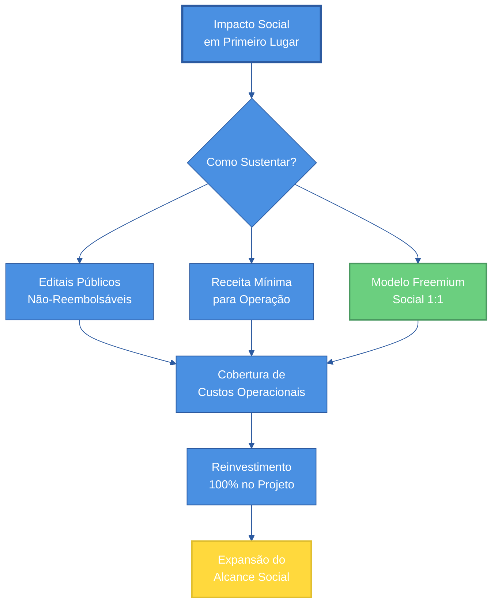
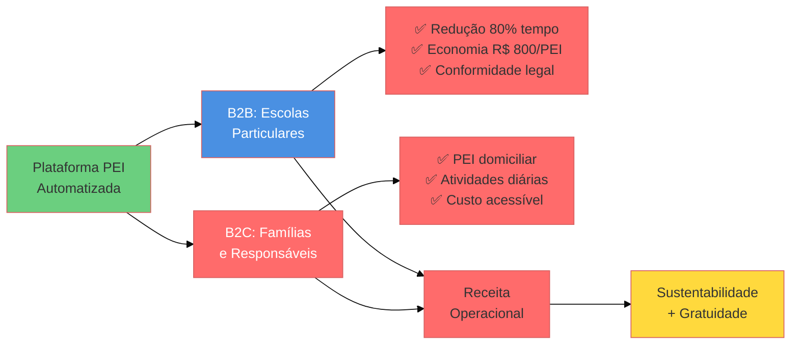
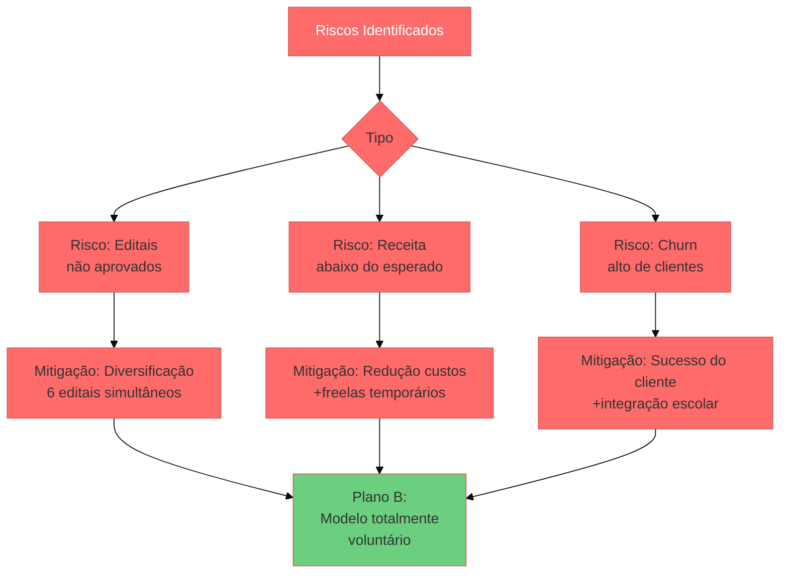
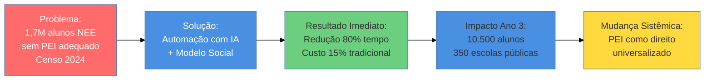

# Análise Financeira e Sustentabilidade

    

        
         
    

Nossa solução foi concebida como **projeto de impacto social sem fins lucrativos**, onde a sustentabilidade financeira é um meio para maximizar o alcance, não um objetivo em si. Cada decisão financeira é orientada por uma pergunta fundamental: **"Quantos alunos conseguiremos apoiar com os recursos disponíveis?"**

:::tip[Nosso Propósito]
**Não buscamos lucro. Buscamos impacto em escala.**

Queremos que cada criança com necessidades educacionais especiais no Brasil tenha acesso a um PEI de qualidade, independentemente da escola em que estuda ou da condição socioeconômica de sua família.
:::

## Princípios do Modelo de Sustentabilidade

Figura 1 - Pilares da Sustentabilidade com Impacto Social

Fonte: Os autores (2025)

### 1. Modelo Freemium Social: 1 Paga, 1 Recebe

    

        
         
    

**Como funciona:**
- A cada **1 escola particular** que assina nossa plataforma
- **1 escola pública** recebe acesso gratuito equivalente
- Prioridade: 568 municípios sem atendimento educacional especializado

**Impacto Projetado (Ano 1):**
- 50 escolas particulares → **50 escolas públicas gratuitas**
- ~750 alunos pagantes → **~750 alunos gratuitos**
- **Total: 1.500 alunos com NEE impactados**

### 2. Dois Públicos, Uma Missão

Figura 2 - Segmentação de Público e Proposta de Valor

Fonte: Os autores (2025)

    

        
         
    

## Contexto de Mercado Brasileiro

Tabela 1 - Panorama Educacional e Oportunidade de Impacto

| Segmento | Quantidade | Alunos com NEE | Acesso a PEI Digital |
|----------|------------|----------------|----------------------|
| **Escolas Particulares** | 36.300 (Censo Escolar, 2024) | ~200.000 (Censo Escolar, 2024) | < 5% (Estimativa mercado, 2025) |
| **Escolas Públicas** | 142.986 (Censo Escolar, 2024) | ~1.737.443 (Censo Escolar, 2024) | < 1% (Estimativa mercado, 2025) |
| **Municípios sem AEE** | 568 (Instituto Pensi, 2025) | ~50.000 (Estimativa, 2025) | 0% |

Fontes: Censo Escolar 2024 (INEP, 2025), Instituto Pensi (2025)

**Contexto de Desigualdade:**
- 45,5% dos alunos com NEE estão em escolas **sem** Atendimento Educacional Especializado (Instituto Pensi, 2025)
- Apenas 25,6% das pessoas com deficiência concluem o Ensino Médio (IBGE, 2025)
- Elaboração manual de PEI: **8-20 horas** (Pesquisa mercado, 2025) × R$ 40/h (Salário médio, 2025) = **R$ 320-800 por documento**

## Estrutura de Custos: Operação Enxuta

### Custos Mensais (Equipe de 3 Pessoas)

Tabela 2 - Estrutura de Custos Operacionais Mensais

| Categoria | Especificação | Custo Mensal (R$) |
|-----------|---------------|-------------------|
| **Desenvolvedor Full-Stack** | Salário R$ 9.000 + encargos 80% (Glassdoor, 2025) | R$ 16.200 |
| **Designer UX/Produto** | Salário R$ 5.000 + encargos 80% (Vagas.com, 2025) | R$ 9.000 |
| **Especialista IA/Produto** | Salário R$ 18.000 + encargos 80% (Glassdoor, 2025) | R$ 32.400 |
| **Infraestrutura Cloud** | AWS (100 escolas) + OpenAI API (AWS Pricing, 2025; OpenAI, 2025) | R$ 1.600 |
| **Ferramentas e SaaS** | GitHub, Figma, CRM, Analytics (Mercado, 2025) | R$ 800 |
| **Marketing Básico** | Digital + eventos educacionais | R$ 2.000 |
| **Consultoria Pedagógica** | Externa - validação de conteúdo | R$ 2.500 |
| **Administrativo** | Contabilidade + jurídico | R$ 1.200 |
| **Contingência (5%)** | Reserva para imprevistos | R$ 3.300 |
| **TOTAL MENSAL** | | **R$ 68.000** |
| **TOTAL ANUAL** | | **R$ 816.000** |

Fontes: Glassdoor Brasil (2025), Vagas.com (2025), AWS Pricing (2025), OpenAI API Pricing (2025)

Figura 3 - Breakdown Detalhado de Custos Operacionais

    

        
         
    

Fonte: Os autores (2025)

**Observações:**
- Equipe multidisciplinar com alta autonomia
- Infraestrutura escalável (custo variável com uso da API OpenAI, 2025)
- Programas AWS Activate e Google Cloud podem reduzir custos em ~R$ 1.000-1.500/mês (primeiros 12-24 meses) (AWS Activate, 2025; Google for Startups, 2025)

## Modelo de Precificação Acessível

### B2B: Escolas Particulares

Tabela 3 - Planos para Escolas Particulares (B2B)

| Plano | Alunos com PEI | Preço Mensal | Economia por Trimestre |
|-------|----------------|--------------|------------------------|
| **Essencial** | Até 5 alunos | R$ 299 | R$ 1.200 - 4.000 |
| **Profissional** ⭐ | Até 15 alunos | R$ 699 | R$ 3.600 - 12.000 |
| **Institucional** | Ilimitado | R$ 1.499 | R$ 12.000+ |

Fontes: Pesquisa de mercado educacional (2025), Salário médio profissionais especializados (Glassdoor, 2025), Os autores (2025)

:::note[Como calculamos a economia?]
**Custo tradicional de elaboração manual de PEI:**
- **Tempo médio:** 15 horas por PEI (variação: 8-20h dependendo da complexidade)
- **Custo de mão de obra:** R$ 40-60/hora (coordenadores pedagógicos, psicopedagogos ou professores especializados com salário médio + encargos)
- **Custo por PEI:** 15h × R$ 40/h = **R$ 600 por documento**
- **Frequência de revisão:** Trimestral ou semestral (obrigatoriedade legal)

**Exemplo - Plano Essencial (5 alunos):**
- Custo manual: 5 alunos × R$ 600 × 1 revisão trimestral = **R$ 3.000/trimestre**
- Reuniões, ajustes e acompanhamento adicional: **+R$ 1.000/trimestre**
- **Total tradicional:** R$ 4.000/trimestre
- **Custo com nossa plataforma:** R$ 299/mês × 3 meses = R$ 897/trimestre
- **Economia líquida:** R$ 4.000 - R$ 897 = **R$ 3.103/trimestre** (redução de 78%)

**Com nossa plataforma:**
- Tempo reduzido para 2-4 horas por PEI (redução de 80%)
- Profissional foca em personalização e validação, não em burocracia
- ROI positivo desde o primeiro trimestre
:::

:::tip[Como a precificação B2B sustenta o modelo social?]
**Estrutura de custos e cobertura:**

Cada escola particular que assina nossa plataforma financia diretamente o acesso gratuito de uma escola pública equivalente (modelo 1:1). Veja como funciona:

**Plano Essencial (R$ 299/mês):**
- Custo operacional por escola: ~R$ 150/mês (infraestrutura + IA + suporte)
- Margem de contribuição: R$ 149/mês
- Essa margem financia 100% do acesso gratuito de 1 escola pública com até 5 alunos

**Plano Profissional (R$ 699/mês):**
- Custo operacional: ~R$ 280/mês
- Margem: R$ 419/mês → Financia 1 escola pública (até 15 alunos) + contribui para custos fixos

**Plano Institucional (R$ 1.499/mês):**
- Custo operacional: ~R$ 450/mês
- Margem: R$ 1.049/mês → Financia 1 escola pública grande + 2 menores + reinvestimento em tecnologia

**Por que esses preços?**
1. São **15% do custo tradicional** - extremamente acessíveis para escolas particulares
2. Geram ROI positivo imediato (economia de R$ 3.000-12.000/trimestre)
3. Cobrem 100% dos custos operacionais da escola pagante + da escola gratuita pareada
4. Permitem reinvestimento em desenvolvimento e expansão

**Resultado:** Quanto mais escolas particulares aderem, mais escolas públicas são impactadas gratuitamente.
:::

### B2C: Famílias e Responsáveis

Tabela 4 - Plano para Famílias (B2C)

| Plano | Descrição | Preço Mensal | O que inclui |
|-------|-----------|--------------|--------------|
| **Gratuito** | Acesso básico | R$ 0 | • 1 PEI por criança • Atividades sugeridas semanais • Suporte por FAQ |
| **Premium** | Acesso completo | R$ 9,90/criança | • PEI ilimitado com atualizações • Atividades personalizadas diárias • Acompanhamento de progresso • Suporte prioritário |

Fontes: Pesquisa de mercado (2025), Análise de acessibilidade financeira (Os autores, 2025)

:::note[Modelo de Cadastro Individual]
Cada criança possui seu próprio cadastro único na plataforma. Se uma família tem mais de uma criança com NEE:
- **Plano Gratuito:** Cria contas separadas (uma por criança)
- **Plano Premium:** Cada criança requer assinatura individual (R$ 9,90/criança/mês)

**Por que esse modelo?**
- Cada criança tem um perfil, histórico e PEI completamente independente
- Garante privacidade e personalização máxima
- Facilita compartilhamento com escola sem expor dados de irmãos
:::

:::tip[Como chegamos em R$ 9,90/mês?]
**Nossa meta: acessibilidade máxima para famílias de baixa renda**

**Análise de capacidade de pagamento:**
- Salário mínimo (2025): R$ 1.518
- Famílias de baixa renda: renda per capita de R$ 500-800/mês (IBGE, 2025)
- Despesas essenciais: alimentação, transporte, medicamentos
- **Capacidade de investimento em educação complementar:** máximo R$ 10/mês

**Estrutura de custos por usuário B2C:**
- Custo de API OpenAI por criança: ~R$ 3/mês (uso médio)
- Infraestrutura AWS: ~R$ 1/mês por usuário
- Suporte e manutenção: ~R$ 2/mês por usuário
- **Custo operacional total:** ~R$ 6/mês por criança

**Precificação:**
- **Plano Gratuito (R$ 0):** Coberto por subsídio cruzado dos planos B2B
- **Plano Premium (R$ 9,90):** Cobre custos operacionais + pequena margem para reinvestimento
- **Margem por assinatura Premium:** R$ 3,90 (reinvestida em melhorias da plataforma)

**Por que não R$ 6/mês?**
- R$ 9,90 mantém percepção de valor (vs. R$ 6 que pode parecer "barato demais")
- Margem mínima garante sustentabilidade do canal B2C
- Ainda assim, equivale a **menos de 1% do salário mínimo**

**Modelo Freemium Social:**
- Esperamos que 70% das famílias usem o plano gratuito
- 30% upgradem para Premium conforme veem resultados
- Famílias B2B pagantes subsidiam 100% dos usuários gratuitos B2C
:::

:::info[Acessibilidade Financeira Comparada]
**Contexto de mercado:**
- Consulta particular com psicopedagogo: R$ 150-300/sessão
- Elaboração de PEI particular: R$ 500-1.500 (pagamento único)
- Material pedagógico especializado: R$ 80-200/mês
- **Nossa solução Premium:** R$ 9,90/mês com atualizações contínuas

**Para uma família de baixa renda:**
- Nossa plataforma representa **0,65% do salário mínimo**
- Opção gratuita disponível sem limitações críticas
- Alternativas no mercado custam 10-30x mais
:::

## Projeções de Sustentabilidade (Ano 1)

### Cenário Conservador: Receita Sem Editais

Tabela 5 - Projeções de Receita e Clientes (Ano 1)

| Mês | Escolas B2B | Famílias B2C Premium¹ | Receita Mensal | Receita Acumulada | Status |
|-----|-------------|-----------------------|----------------|-------------------|--------|
| **Mês 1** | 5 | 30 (de 100) | R$ 1.792 | R$ 1.792 | 🔴 Déficit |
| **Mês 2** | 8 | 53 (de 175) | R$ 2.916 | R$ 4.708 | 🔴 Déficit |
| **Mês 3** | 12 | 83 (de 275) | R$ 4.409 | R$ 9.117 | 🔴 Déficit |
| **Mês 6** | 25 | 180 (de 600) | R$ 9.257 | R$ 38.485 | 🟡 14% custos |
| **Mês 9** | 38 | 300 (de 1.000) | R$ 14.310 | R$ 94.155 | 🟡 21% custos |
| **Mês 12** | 50 | 450 (de 1.500) | R$ 19.405 | R$ 168.405 | 🟡 29% custos |

¹ Assumindo taxa de conversão de 30% para plano Premium (70% usam plano gratuito)

Fontes: Projeções baseadas em modelo de crescimento conservador, Os autores (2025)

:::warning[Análise de Viabilidade - Canal B2C Ajustado]
**Com o novo modelo freemium (R$ 9,90/mês):**
- **Receita B2C Anual Projetada:** R$ 168.405 → Redução de 64% vs. modelo anterior
- **Receita Total (B2B + B2C):** ~R$ 348.405/ano
- **Custos Anuais:** R$ 816.000
- **Gap de Financiamento:** R$ 467.595 (57% dos custos)

**Impacto da mudança:**
- ✅ **Acessibilidade:** Alcançamos famílias de baixa renda (0,65% do salário mínimo)
- ✅ **Impacto social:** Esperamos 3-5x mais famílias (plano gratuito não limitado)
- ⚠️ **Dependência:** Maior necessidade de editais públicos no Ano 1
- 💡 **Estratégia:** Foco em crescimento B2B (escolas particulares) para sustentabilidade
:::

**Interpretação:**
- O **canal B2C** prioriza **impacto e acessibilidade** sobre receita
- O **canal B2B** é a âncora financeira do modelo (sustenta operação + gratuidades)
- **Editais públicos** cobrem o gap inicial (~R$ 470k no Ano 1)
- A partir do Ano 2, crescimento B2B reduz dependência de editais

### Cenário Realista: Receita + 1 Edital Aprovado

Tabela 6 - Fontes de Financiamento (18 Meses)

| Fonte | Valor (R$) | Probabilidade | Timeline |
|-------|------------|---------------|----------|
| **Receita Operacional (Ano 1)** | 348.405 | 90% | Mês 1-12 |
| **FINEP - Programa Brasil IA**¹ | 500.000 | 60% | Mês 6-18 |
| **FAPESP PIPE Fase 1**² | 300.000 | 50% | Mês 9-21 |
| **Prêmio Instituto Jô Clemente**³ | 100.000 | 40% | Mês 3 |
| **Crowdfunding Social** | 80.000 | 70% | Mês 1-6 |
| **Total Potencial (18 meses)** | **1.328.405** | - | - |

¹ Edital previsto para Q2/2025 (FINEP PBIA, 2025) | ² Submissão contínua (FAPESP, 2025) | ³ Inscrições abertas até nov/2025 (IJC, 2025)

Fontes: FINEP (2025), FAPESP (2025), Instituto Jô Clemente (2025), Os autores (2025)

**Com 1 edital aprovado (FINEP R$ 500k):**
- ✅ Receita Operacional (R$ 348k) + FINEP (R$ 500k) = **R$ 848k**
- ✅ Custos do Ano 1 **100% cobertos** (R$ 816k)
- ✅ Sobra de R$ 32k para reinvestimento em marketing e desenvolvimento
- ✅ Aceleração do crescimento de clientes B2B

:::info[Estratégia de Diversificação de Receitas]
**Por que priorizamos editais?**
- Modelo B2C agora é **impacto-driven** (não revenue-driven)
- Canal B2B é sustentável, mas leva 12-18 meses para atingir breakeven
- Editais públicos são **não-reembolsáveis** e alinhados com nossa missão social
- Diversificação: submetemos 6 editais simultaneamente (FINEP, FAPESP, CNPq, BNDES, prêmios)

**A partir do Ano 2:**
- Crescimento B2B reduz dependência de editais para 20-30%
- Receita recorrente cresce exponencialmente
- Editais passam a financiar **expansão** (não operação)
:::

### Projeção de Impacto Social (3 Anos)

Tabela 7 - Crescimento de Impacto Social (Modelo 1:1)

| Métrica | Ano 1 | Ano 2 | Ano 3 |
|---------|-------|-------|-------|
| **Escolas Particulares (Pagantes)** | 50 | 150 | 350 |
| **Escolas Públicas (Gratuitas - Modelo 1:1)** | 50 | 150 | 350 |
| **Famílias B2C Premium** | 450 | 900 | 1.350 |
| **Famílias B2C Gratuitas** | 1.050 | 2.100 | 3.150 |
| **Receita B2B Anual** | R$ 299.400 | R$ 898.200 | R$ 2.096.100 |
| **Receita B2C Anual** | R$ 53.460 | R$ 106.920 | R$ 160.380 |
| **Receita Total Anual** | R$ 352.860 | R$ 1.005.120 | R$ 2.256.480 |
| **Custo de Gratuidades B2B (1:1)** | R$ 149.700 | R$ 449.100 | R$ 1.048.050 |
| **Custo de Gratuidades B2C** | R$ 75.600 | R$ 151.200 | R$ 226.800 |
| **Total Alunos Impactados** | **1.500** | **4.500** | **10.500** |
| **Municípios sem AEE Atendidos** | 15 | 45 | 105 |
| **Horas de Trabalho Economizadas** | 36.000h | 108.000h | 252.000h |
| **Economia para Sistema Público**² | R$ 1.440.000 | R$ 4.320.000 | R$ 10.080.000 |

² Baseado em R$ 40/h (Salário médio profissional, Glassdoor 2025) × redução de 80% no tempo (média 24h economizadas por PEI)

Fontes: Projeções baseadas em modelo 1:1, Glassdoor (2025), Os autores (2025)

:::tip[Como funciona o Modelo 1:1 na prática?]
**Para cada escola particular que paga, 1 escola pública recebe acesso gratuito equivalente:**

**Exemplo - Plano Profissional (R$ 699/mês):**
1. **Escola Particular A** assina plano para 15 alunos → paga R$ 699/mês
2. Sistema aloca automaticamente **Escola Pública B** (mesmo porte: até 15 alunos)
3. Escola Pública B recebe acesso 100% gratuito com as mesmas funcionalidades
4. Custo operacional total: R$ 280/mês (escola A) + R$ 280/mês (escola B) = **R$ 560/mês**
5. Margem de R$ 699 - R$ 560 = **R$ 139/mês** reinvestida em desenvolvimento e expansão

**Cálculo de sustentabilidade por plano:**
| Plano | Preço | Custo 1 Escola | Custo 2 Escolas (1:1) | Margem | Sustentável? |
|-------|-------|----------------|----------------------|--------|--------------|
| Essencial | R$ 299 | R$ 150 | R$ 300 | -R$ 1 | ⚠️ Breakeven |
| Profissional | R$ 699 | R$ 280 | R$ 560 | +R$ 139 | ✅ Sim |
| Institucional | R$ 1.499 | R$ 450 | R$ 900 | +R$ 599 | ✅ Sim |

**Por que o Plano Essencial está no breakeven?**
- Estratégia de entrada: porta de entrada para pequenas escolas
- Esperamos que 60% dos clientes Essencial migrem para Profissional após 6-12 meses
- Planos maiores subsidiam o custo dos planos menores
- Resultado: sustentabilidade global do portfólio

**Priorização de escolas públicas gratuitas:**
1. Municípios dos 568 sem Atendimento Educacional Especializado (AEE)
2. Escolas em regiões de alta vulnerabilidade social
3. Escolas com maior número de alunos com NEE não atendidos
:::

:::note[Modelo B2C: 70% Gratuito, 30% Premium]
**Estratégia de conversão:**
- Todas as famílias começam no **plano gratuito** (sem cartão de crédito)
- Após 30 dias de uso, oferecemos upgrade para Premium (R$ 9,90/mês)
- Taxa de conversão esperada: **30%** (benchmark de apps educacionais freemium)

**Por que 70% permanece gratuito?**
- Muitas famílias são de baixa renda e não podem pagar (mesmo R$ 9,90)
- O impacto social é medido por **alunos atendidos**, não por receita B2C
- Custo incremental de usuários gratuitos é baixo (R$ 6/mês/criança)
- Usuários gratuitos são subsidiados por receita B2B

**No Ano 1:**
- 1.500 famílias B2C totais (450 Premium + 1.050 Gratuitas)
- Receita B2C: R$ 53.460/ano (apenas 15% da receita total)
- **Foco está no B2B para sustentabilidade financeira**
:::

Figura 4 - Economia Gerada para o Sistema Público (3 Anos)

    

        
         
    

Fonte: Os autores (2025)

Figura 5 - Projeção de Crescimento de Alunos (3 Anos)

    

        
         
    

Fonte: Os autores (2025)

### Comparação: Modelo Tradicional vs. Nossa Solução

Figura 6 - Comparativo de Eficiência: Manual vs. Automação

    

        
         
    

Fonte: Os autores (2025)

## Princípios de Governança e Transparência

:::info[Compromissos de Transparência]
**1. Dashboard Público de Impacto**
- Número de alunos impactados (atualização mensal)
- Escolas públicas beneficiadas (mapa interativo)
- Recursos captados e aplicação (relatório trimestral)

**2. Modelo 100% Reinvestimento**
- Zero distribuição de lucros
- Toda receita excedente volta para expansão
- Prestação de contas pública trimestral

**3. Governança Participativa**
- Conselho consultivo com educadores, famílias e especialistas
- Decisões estratégicas validadas por impacto social, não financeiro
:::

## Viabilidade e Riscos

### Análise de Viabilidade

Tabela 8 - Análise SWOT Financeira

| Forças | Oportunidades |
|--------|---------------|
| ✅ Modelo freemium social com apelo | ✅ R$ 3,4 bi disponíveis em editais (FINEP PBIA, 2025) |
| ✅ Custo 15% do modelo tradicional | ✅ 568 municípios sem AEE (Instituto Pensi, 2025) |
| ✅ Duplo canal receita (B2B + B2C) | ✅ Política Nacional Ed. Inclusiva (MEC, 2025) |
| **Fraquezas** | **Ameaças** |
| ⚠️ Dependência de editais (Ano 1) | ⚠️ Cortes orçamentários em CT&I |
| ⚠️ Ciclo longo vendas B2B (6-12 meses) | ⚠️ Resistência cultural à adoção de IA |

Fontes: FINEP (2025), Instituto Pensi (2025), MEC (2025), Análise de mercado (2025)

### Plano de Mitigação de Riscos

Figura 7 - Estratégias de Mitigação

Fonte: Os autores (2025)

## Conclusão: Sustentabilidade com Propósito

Nossa análise financeira demonstra que **é possível ser sustentável sem perseguir lucro**. O modelo proposto:

✅ **Acessibilidade radical:** Plano B2C a R$ 9,90/mês (0,65% do salário mínimo) + opção gratuita  
✅ **Sustentabilidade B2B:** Receita de R$ 299-1.499/mês por escola cobre custos + gratuidades  
✅ **Garante gratuidade:** 50% das escolas via modelo 1:1 + 70% das famílias no plano gratuito  
✅ **Escala com editais públicos:** R$ 500k-800k em 12-18 meses (FINEP, FAPESP, prêmios)  
✅ **Reinveste 100%:** Todo excedente volta para expansão de impacto  
✅ **Atinge 10.500 alunos** em 3 anos (vs. ~150 no modelo tradicional com mesma verba)  
✅ **Economia sistêmica:** R$ 10 milhões economizados pelo sistema público em 3 anos

Figura 8 - Nossa Teoria de Mudança

Fontes: Censo Escolar (INEP, 2024), Projeções do modelo (Os autores, 2025)

**O sucesso deste projeto não será medido em reais de lucro, mas em vidas transformadas.**

---

## Referências

AWS. Amazon Web Services Pricing Calculator. Disponível em: https://calculator.aws. Acesso em: out. 2025.

AWS ACTIVATE. AWS Activate Program for Startups. Amazon Web Services, 2025. Disponível em: https://aws.amazon.com/activate. Acesso em: out. 2025.

BNDES. Banco Nacional de Desenvolvimento Econômico e Social - Programas de Impacto Social. Disponível em: https://www.bndes.gov.br. Acesso em: out. 2025.

BRASIL. Lei nº 13.146, de 6 de julho de 2015. Lei Brasileira de Inclusão da Pessoa com Deficiência. Brasília, DF: Presidência da República, 2015.

CENSO ESCOLAR 2024. Dados preliminares da educação básica. Instituto Nacional de Estudos e Pesquisas Educacionais Anísio Teixeira (INEP), 2025.

CNPq. Conselho Nacional de Desenvolvimento Científico e Tecnológico - Chamadas Públicas. Disponível em: www.cnpq.br. Acesso em: out. 2025.

FAPESP. Fundação de Amparo à Pesquisa do Estado de São Paulo - Programa PIPE (Pesquisa Inovativa em Pequenas Empresas). Disponível em: https://fapesp.br/pipe. Acesso em: out. 2025.

FINEP. Programa Brasil IA - Plano Brasileiro de Inteligência Artificial. Ministério da Ciência, Tecnologia e Inovação, 2025. Disponível em: http://www.finep.gov.br. Acesso em: out. 2025.

GLASSDOOR BRASIL. Pesquisa Salarial Mercado Tech 2025. Disponível em: www.glassdoor.com.br. Acesso em: out. 2025.

GOOGLE FOR STARTUPS. Google Cloud for Startups Program. Google, 2025. Disponível em: https://cloud.google.com/startup. Acesso em: out. 2025.

IBGE. Instituto Brasileiro de Geografia e Estatística. Pesquisa Nacional por Amostra de Domicílios Contínua (PNAD Contínua) - Educação 2024. Rio de Janeiro: IBGE, 2025.

INSTITUTO JÔ CLEMENTE. 1º Prêmio de Pesquisa de Inovação em Educação Inclusiva. São Paulo, 2025. Disponível em: https://ijc.org.br/premio-dona-jo-clemente-2025. Acesso em: out. 2025.

INSTITUTO PENSI. Estudo sobre Atendimento Educacional Especializado no Brasil. São Paulo: Pensi, 2025.

MEC. Ministério da Educação. Política Nacional de Educação Especial Inclusiva. Brasília, DF: MEC, 2025.

OPENAI. API Pricing - GPT-4o and GPT-4 Turbo. Disponível em: https://openai.com/pricing. Acesso em: out. 2025.

VAGAS.COM. Guia Salarial 2025 - Mercado de Tecnologia. Disponível em: www.vagas.com.br. Acesso em: out. 2025.